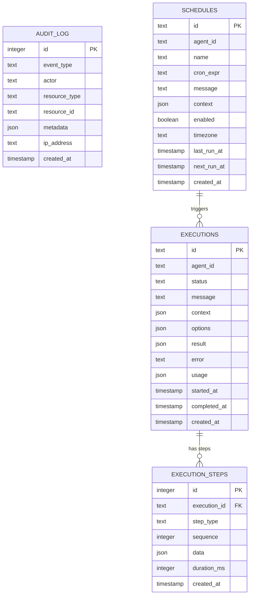

# feat: Build Agent Gateway Framework

## Overview

Build `agent-gateway` — an opinionated FastAPI extension for building API-first AI agent services. Define agents, skills, and tools as markdown files. Get production-ready agent endpoints alongside custom routes — with auth, structured outputs, observability, scheduled jobs (cron), and outbound notifications.

This is a **greenfield build** from a detailed design document (`DESIGN.md`). The system must be **robust**: graceful degradation, layered timeouts, isolated tool execution, atomic hot-reload, structured error handling, and full observability from day one.

## Problem Statement / Motivation

Building AI agent services today requires hand-wiring the same boilerplate every time: HTTP server, request validation, auth, LLM function-calling loops, tool dispatch, retries, timeouts, audit logging, notifications, and cost tracking. This framework eliminates that repetition by providing an opinionated, convention-based layer on top of FastAPI.

## Technical Approach

### Architecture

```
Gateway(FastAPI)
    |
    +-- Workspace Loader (scan filesystem, parse markdown+YAML)
    |     +-- Agent definitions (AGENT.md, SOUL.md, CONFIG.md)
    |     +-- Skill definitions (SKILL.md)
    |     +-- Tool definitions (TOOL.md, handler.py)
    |     +-- Cron definitions (CRON.md or CONFIG.md schedules)
    |
    +-- API Layer (auto-generated routes under /v1/)
    |     +-- invoke, executions, introspection, hooks, health
    |
    +-- Execution Engine (LLM function-calling loop)
    |     +-- LLM Client (LiteLLM Router with failover)
    |     +-- Tool Dispatcher (HTTP, function, script executors)
    |     +-- Output Validator (structured output + retry)
    |     +-- Approval Gates
    |
    +-- Scheduler (cron-based agent invocations)
    |     +-- APScheduler or custom asyncio scheduler
    |     +-- Persistent job store (DB-backed)
    |
    +-- Auth Middleware (API key, custom)
    +-- Notification Engine (Slack, Teams, webhook)
    +-- Persistence (SQLAlchemy async: SQLite/PostgreSQL)
    +-- Telemetry (OpenTelemetry traces + metrics)
    +-- File Watcher (hot-reload via watchfiles)
```

### Execution State Machine

```
                    +----------+
                    |  queued   |
                    +----+-----+
                         |
                    +----v-----+
               +--->|  running  |<-----------+
               |    +----+-----+             |
               |         |                   |
               |    +----v-----------+  +----+-----+
               |    | approval_pending|  | cancelled |
               |    +----+-----------+  +----------+
               |         |
               |    approved / denied
               |         |
               +---------+
                         |
              +----------+----------+
              |          |          |
         +----v---+ +----v---+ +---v-----+
         |completed| | failed | | timeout |
         +--------+ +--------+ +---------+
```

Valid transitions:
- `queued` -> `running`
- `running` -> `completed` | `failed` | `cancelled` | `timeout` | `approval_pending`
- `approval_pending` -> `running` (approved) | `cancelled` | `denied`
- Timeout clock **pauses** during `approval_pending`

### Error Response Format (Standard)

All error responses use a consistent envelope:

```json
{
  "error": {
    "code": "agent_not_found",
    "message": "Agent 'foo' does not exist",
    "execution_id": "exec_abc123",
    "details": {}
  }
}
```

HTTP status codes: `400` (bad request), `401` (unauthenticated), `403` (forbidden/scope), `404` (not found), `409` (invalid state transition), `422` (validation), `429` (rate limit), `503` (LLM unavailable).

### Cron / Scheduled Agent Invocations

Agents can be invoked on a schedule via cron expressions. Defined in the agent's `CONFIG.md`:

```yaml
# workspace/agents/portfolio-monitor/CONFIG.md
---
model:
  name: google/gemini-2.5-flash

schedules:
  - name: daily-portfolio-review
    cron: "0 8 * * 1-5"          # 8am UTC, weekdays
    message: "Run daily portfolio risk review for all active facilities"
    context:
      source: "scheduled"
      job_name: "daily-portfolio-review"
    enabled: true
    timezone: "Europe/London"

  - name: weekly-compliance-scan
    cron: "0 6 * * 1"            # 6am UTC, Mondays
    message: "Run weekly compliance scan across all active borrowers"
    enabled: true
---
```

**Implementation approach:**
- Use `APScheduler` (v4.x, async-native) with a DB-backed job store
- Schedules discovered during workspace loading alongside agents/skills/tools
- Hot-reload: schedule changes detected and jobs updated without restart
- Each scheduled run creates a standard execution (same as `POST /v1/agents/{id}/invoke`)
- Scheduled executions are tagged with `source: "scheduled"` in context
- Missed job handling: configurable `misfire_grace_time` (default 60s) — if the server was down when a job should have fired, it runs on startup if within the grace window
- Overlapping runs prevented with `max_instances: 1` per schedule by default

**Introspection:**
```
GET  /v1/schedules                    # List all schedules
GET  /v1/schedules/{schedule_id}      # Schedule details + next run time
POST /v1/schedules/{schedule_id}/run  # Manually trigger a scheduled job
POST /v1/schedules/{schedule_id}/pause   # Pause a schedule
POST /v1/schedules/{schedule_id}/resume  # Resume a paused schedule
```

**CLI:**
```bash
agent-gateway schedules              # List all schedules with next run times
agent-gateway schedule-run <id>      # Manually trigger a schedule
```

### Tool Execution Context

Tools (both `handler.py` and `@gw.tool`) receive a `context` object:

```python
@dataclass
class ToolContext:
    execution_id: str
    agent_id: str
    caller_identity: str | None      # From auth
    trace_span: Span                  # Current OTel span
    metadata: dict                    # From request context
```

### Concurrency Model

- **Parallel tool calls**: When the LLM returns multiple tool calls in one response, execute concurrently with `asyncio.TaskGroup` + `Semaphore(max_concurrency=5)`
- **Agent isolation**: Each invocation is fully isolated — no shared mutable state between concurrent executions of the same agent
- **Tool result size limit**: Truncate tool results to 32KB (configurable) with truncation notice appended

### Non-Goals (v1)

- Multi-turn conversations (single request-response; build on top if needed)
- Multi-tenancy (single-tenant, run in your own infra)
- Agent-to-agent communication (compose via code using `gw.invoke()`)
- `bearer_jwt` auth mode (custom auth handler covers this; add as built-in later)
- Webhook receiver (`POST /v1/hooks/{hook_id}`) — deferred to v1.1
- Containerized script sandboxing — deferred to v1.1

---

## Implementation Phases

### Phase 1: Foundation (Core Package + Workspace + Engine)

**Goal**: `pip install agent-gateway`, define agents as markdown, invoke via API, get traces in console.

#### 1.1 Package Scaffolding

- [x] Initialize project with `uv init --lib --build-backend hatch`
- [x] Create `src/agent_gateway/` layout per DESIGN.md Section 20
- [x] Configure `pyproject.toml` with all dependencies and optional extras
- [x] Add `py.typed` marker for PEP 561
- [x] Create `.gitignore`, `LICENSE` (MIT)
- [x] Set up `ruff` linting and `mypy` strict mode
- [x] Set up `pytest` + `pytest-asyncio` with `asyncio_mode = "auto"`
- [x] Create test fixtures directory with sample workspace

**Files:**
```
pyproject.toml
src/agent_gateway/__init__.py
src/agent_gateway/py.typed
src/agent_gateway/exceptions.py
tests/conftest.py
tests/fixtures/workspace/agents/test-agent/AGENT.md
tests/fixtures/workspace/skills/test-skill/SKILL.md
tests/fixtures/workspace/tools/test-tool/TOOL.md
.gitignore
LICENSE
```

#### 1.1b Test Project (Editable Symlink)

A real example project inside the repo that uses the library via an editable path dependency. Any change to `src/agent_gateway/` is immediately available — no reinstall needed.

- [x] Create `examples/test-project/` with its own `pyproject.toml`
- [x] Configure `uv` workspace in the root `pyproject.toml`
- [x] Set up example workspace with a working agent, skill, tool, and schedule
- [x] Add a `Makefile` or `justfile` at the repo root for common dev commands

**Root `pyproject.toml` workspace config:**

```toml
[tool.uv.workspace]
members = ["examples/test-project"]
```

**`examples/test-project/pyproject.toml`:**

```toml
[project]
name = "test-project"
version = "0.1.0"
requires-python = ">=3.11"
dependencies = [
    "agent-gateway",           # resolved from workspace (editable)
]

[tool.uv.sources]
agent-gateway = { workspace = true }
```

**`examples/test-project/app.py`:**

```python
from agent_gateway import Gateway

gw = Gateway(workspace="./workspace")

@gw.tool()
async def echo(message: str) -> dict:
    """Echo a message back — for testing the tool pipeline."""
    return {"echo": message}

@gw.tool()
async def add_numbers(a: float, b: float) -> dict:
    """Add two numbers — for testing structured params."""
    return {"result": a + b}

@gw.get("/api/health")
async def health():
    return {"status": "ok", "project": "test-project"}

gw.run()
```

**`examples/test-project/workspace/` layout:**

```
examples/test-project/
├── app.py
├── pyproject.toml
├── .env.example
└── workspace/
    ├── gateway.yaml
    ├── agents/
    │   ├── AGENTS.md                 # Root system prompt
    │   ├── assistant/
    │   │   ├── AGENT.md              # Simple helpful assistant
    │   │   ├── SOUL.md               # Friendly, concise
    │   │   └── CONFIG.md             # Default model, echo + add tools
    │   └── scheduled-reporter/
    │       ├── AGENT.md              # Generates daily summaries
    │       └── CONFIG.md             # Has a cron schedule
    ├── skills/
    │   └── math-workflow/
    │       └── SKILL.md              # Multi-step math using add_numbers
    └── tools/
        └── http-example/
            └── TOOL.md               # HTTP tool calling httpbin.org
```

**Developer workflow:**

```bash
# From repo root — one command to set up everything
uv sync

# Run the test project (library changes reflected immediately)
uv run --directory examples/test-project python app.py

# Or from the test project directory
cd examples/test-project
uv run python app.py

# Run library tests
uv run pytest

# Quick validation curl
curl -X POST http://localhost:8000/v1/agents/assistant/invoke \
  -H "Content-Type: application/json" \
  -d '{"message": "What is 2 + 3?"}'
```

**`Makefile` (repo root):**

```makefile
.PHONY: dev test lint check

dev:                                  ## Run the test project
	uv run --directory examples/test-project python app.py

test:                                 ## Run library tests
	uv run pytest

lint:                                 ## Lint + typecheck
	uv run ruff check src/ tests/
	uv run mypy src/

check:                                ## Validate test project workspace
	uv run agent-gateway check --workspace examples/test-project/workspace
```

#### 1.2 Configuration System

- [x] `src/agent_gateway/config.py` — Pydantic `BaseSettings` with nested models
- [x] Parse `gateway.yaml` with cascading defaults
- [x] Environment variable overrides with `AGENT_GATEWAY_` prefix
- [x] `.env` loading via `python-dotenv`
- [x] Validate configuration on load with clear error messages

```python
# src/agent_gateway/config.py
class ModelConfig(BaseModel):
    default: str = "gpt-4o-mini"
    temperature: float = 0.1
    max_tokens: int = 4096
    fallback: str | None = None

class GuardrailsConfig(BaseModel):
    max_tool_calls: int = 20
    max_iterations: int = 10
    timeout_ms: int = 60_000

class ServerConfig(BaseModel):
    host: str = "0.0.0.0"
    port: int = 8000
    workers: int = 1

class GatewayConfig(BaseSettings):
    server: ServerConfig = ServerConfig()
    model: ModelConfig = ModelConfig()
    guardrails: GuardrailsConfig = GuardrailsConfig()
    # ... auth, persistence, notifications, telemetry, context
```

#### 1.3 Exception Hierarchy

- [x] Define structured exception classes

```python
# src/agent_gateway/exceptions.py
class AgentGatewayError(Exception): ...
class WorkspaceError(AgentGatewayError): ...
class ConfigError(AgentGatewayError): ...
class ExecutionError(AgentGatewayError): ...
class ToolError(ExecutionError): ...
class GuardrailTriggered(ExecutionError):
    def __init__(self, reason: str, partial_result: str | None = None): ...
class AuthError(AgentGatewayError): ...
```

#### 1.4 Workspace Loader

- [x] `src/agent_gateway/workspace/parser.py` — Markdown + YAML frontmatter parser using `python-frontmatter`
- [x] `src/agent_gateway/workspace/agent.py` — Agent model: load AGENT.md + SOUL.md + CONFIG.md, validate
- [x] `src/agent_gateway/workspace/skill.py` — Skill model: load SKILL.md, parse tools list
- [x] `src/agent_gateway/workspace/tool.py` — Tool model: load TOOL.md, parse parameters + type + handler
- [x] `src/agent_gateway/workspace/schedule.py` — Schedule model: parse cron schedules from CONFIG.md (integrated into agent.py)
- [x] `src/agent_gateway/workspace/loader.py` — Scan workspace dirs, discover agents/skills/tools/schedules, validate cross-references
- [x] `src/agent_gateway/workspace/prompt.py` — Assemble layered system prompt (root AGENTS.md + root SOUL.md + agent AGENT.md + agent SOUL.md + skill instructions + tool descriptions + context)

**Robustness requirements:**
- Invalid UTF-8 in markdown files: skip file with warning, don't crash
- Missing or empty AGENT.md: skip agent with warning
- CONFIG.md referencing non-existent skill/tool: warn but don't error (lazy resolution at invocation time)
- Directory names with invalid URL characters: sanitize to kebab-case, warn
- Zero-byte files: treat as empty, warn
- Duplicate tool names (file + code): code wins, log info message

**Tests:**
```
tests/test_workspace/test_parser.py
tests/test_workspace/test_loader.py
tests/test_workspace/test_agent.py
tests/test_workspace/test_skill.py
tests/test_workspace/test_tool.py
tests/test_workspace/test_prompt.py
tests/test_workspace/test_schedule.py
```

#### 1.5 Tool Registry

- [x] `src/agent_gateway/workspace/registry.py` — Unified registry for file-based + code-based tools
- [x] Tool schema generation from Python type hints (`Annotated`, Pydantic, bare types, explicit dict)
- [x] `@gw.tool()` decorator implementation with all 4 input spec modes
- [ ] Parameter validation against JSON Schema before tool execution
- [x] Tool permission checking (`allowed_agents`)

```python
# src/agent_gateway/workspace/registry.py
class ToolRegistry:
    def register_file_tool(self, tool: FileTool): ...
    def register_code_tool(self, name: str, fn: Callable, **kwargs): ...
    def get(self, name: str) -> Tool | None: ...
    def resolve_for_agent(self, agent: Agent) -> list[Tool]: ...
    def to_llm_declarations(self, tools: list[Tool]) -> list[dict]: ...
```

#### 1.6 LLM Client (LiteLLM Wrapper)

- [x] `src/agent_gateway/engine/llm.py` — LiteLLM Router wrapper with failover
- [x] Build `model_list` from gateway config + per-agent overrides
- [x] Configure retry policy: 2 retries for timeout, 3 for rate limit, 0 for auth/content errors
- [x] Cooldown: 3 allowed failures per minute, 60s cooldown
- [x] Cost tracking via `litellm.completion_cost()`
- [x] Usage accumulator (input tokens, output tokens, cost, model list)
- [ ] Streaming support via `acompletion(stream=True)`

**Robustness:**
- Both primary and fallback fail: return `StopReason.ERROR` with clear message
- Context preserved across failover (full message history sent to fallback)
- All failover events logged in execution trace

#### 1.7 Execution Engine

- [x] `src/agent_gateway/engine/executor.py` — The core LLM function-calling loop

**State machine implementation:**
- `StopReason` enum: `COMPLETED`, `MAX_ITERATIONS`, `MAX_TOOL_CALLS`, `TIMEOUT`, `CANCELLED`, `ERROR`
- Overall timeout via `asyncio.timeout(timeout_ms / 1000)`
- Per-tool timeout via `asyncio.timeout(tool.timeout_ms / 1000)`
- Cancellation via `asyncio.Event` checked at top of each iteration
- Parallel tool execution via `asyncio.TaskGroup` + `Semaphore(5)`

**Error isolation (critical for robustness):**
- Tool exceptions NEVER crash the loop — errors returned to LLM as tool results
- LLM returning unknown tool name → error returned as tool result, loop continues
- LLM returning malformed tool args → validation error returned as tool result
- LLM returning empty response → treat as completion with empty text
- LLM returning text + tool_calls → process tool calls, ignore text (will regenerate)
- Tool result exceeds 32KB → truncate with notice

**Tests:**
```
tests/test_engine/test_executor.py            # Main loop logic
tests/test_engine/test_executor_timeouts.py   # Timeout scenarios
tests/test_engine/test_executor_guardrails.py # Max iterations/tool calls
tests/test_engine/test_executor_errors.py     # Error isolation
tests/test_engine/test_executor_parallel.py   # Parallel tool execution
tests/test_engine/test_executor_cancel.py     # Cancellation
```

#### 1.8 Tool Executors

- [x] `src/agent_gateway/tools/runner.py` — Dispatch to correct executor based on tool source
- [x] `src/agent_gateway/tools/function.py` — Python function executor (handler.py + @gw.tool)

**HTTP executor robustness:**
- Follow redirects (max 5)
- Return raw body on 4xx (LLM can interpret the error)
- Retry on 5xx: 1 retry with 1s backoff
- Non-JSON response: return as `{"text": "<response body>"}`
- Response size limit: 1MB, truncate with warning
- Connection pooling: shared `httpx.AsyncClient` per tool, closed on shutdown
- Environment variable resolution in URL/headers at execution time (not load time)
- Unresolved `${VAR}`: raise `ConfigError` with clear message naming the missing var

**Function executor:**
- Sync handlers: run in thread via `asyncio.to_thread()`
- Import errors in handler.py: caught at load time, tool marked as broken with error message
- Missing `handle` function: caught at load time

**Script executor:**
- Run via `asyncio.create_subprocess_exec`
- Input: JSON on stdin
- Output: JSON on stdout
- Stderr: captured and logged, not returned to LLM
- Non-zero exit + valid JSON stdout: return the JSON (script may use exit codes for its own purposes)
- Non-zero exit + invalid stdout: return error
- Kill on timeout: SIGTERM, wait 5s, SIGKILL
- Kill on cancellation: same SIGTERM/SIGKILL sequence
- Working directory: the tool's directory (`workspace/tools/{name}/`)
- Environment: inherit process env (includes .env vars), do NOT expose AGENT_GATEWAY_* internal vars

#### 1.9 Structured Output

- [x] `src/agent_gateway/engine/output.py` — Parse and validate LLM output against JSON Schema

**Flow:**
1. If LLM supports native structured output (`response_format`) → use it
2. Otherwise, append schema instructions to system prompt
3. Parse response as JSON
4. Validate against schema
5. If invalid, retry once with correction prompt: `"Your response did not match the required schema. Errors: {errors}. Please respond again with valid JSON matching: {schema}"`
6. If retry also fails: return `result.output = null`, `result.raw_text = <raw>`, add `validation_errors` to response
7. Retry does NOT count against `max_iterations`
8. Retry uses same model (not fallback)
9. Invalid `output_schema` in CONFIG.md: caught at workspace load time, agent marked with warning

#### 1.10 OpenTelemetry Bootstrap

- [x] `src/agent_gateway/telemetry/__init__.py` — `setup_telemetry()` bootstrap
- [x] `src/agent_gateway/telemetry/tracing.py` — Tracer provider, span helpers
- [x] `src/agent_gateway/telemetry/metrics.py` — Meter provider, metric definitions
- [x] `src/agent_gateway/telemetry/attributes.py` — GenAI semantic convention constants

**Traces:** Every execution creates a root span `agent.invoke` with nested spans for `prompt.assemble`, `llm.call`, `tool.execute`, `output.validate`, `notification.send`.

**Metrics:**
- `agw.executions.total` (counter, by agent + status)
- `agw.executions.duration_ms` (histogram)
- `agw.llm.calls.total` (counter, by agent + model + status)
- `agw.llm.duration_ms` (histogram)
- `agw.llm.tokens.input` / `agw.llm.tokens.output` (counters)
- `agw.llm.cost_usd` (counter, by agent + model)
- `agw.tools.calls.total` (counter, by tool + agent + status)
- `agw.tools.duration_ms` (histogram)
- `agw.schedules.runs.total` (counter, by schedule + status)

**GenAI semantic conventions:** Follow OpenTelemetry GenAI spec — `gen_ai.operation.name`, `gen_ai.request.model`, `gen_ai.usage.input_tokens`, etc.

**Zero-config default:** Console exporter in dev. Set `OTEL_EXPORTER_OTLP_ENDPOINT` → auto-switches to OTLP.

**Robustness:** Telemetry setup failure never crashes the server. OTel SDK uses async `BatchSpanProcessor` — non-blocking. Collector unreachable: spans dropped silently (OTel SDK default behavior).

#### 1.11 Persistence Layer

- [x] `src/agent_gateway/persistence/models.py` — SQLAlchemy 2.0 async models
- [x] `src/agent_gateway/persistence/session.py` — Engine + session factory
- [x] `src/agent_gateway/persistence/repository.py` — CRUD operations for executions, steps, audit log
- [x] Auto-create tables on startup via `conn.run_sync(Base.metadata.create_all)`
- [x] `NullPersistence` fallback when persistence is disabled or DB unavailable

**Schema:** Per DESIGN.md Section 17.4 (`executions`, `execution_steps`, `audit_log` tables) plus:

```sql
CREATE TABLE schedules (
    id              TEXT PRIMARY KEY,
    agent_id        TEXT NOT NULL,
    name            TEXT NOT NULL,
    cron_expr       TEXT NOT NULL,
    message         TEXT NOT NULL,
    context         JSON DEFAULT '{}',
    enabled         BOOLEAN DEFAULT TRUE,
    timezone        TEXT DEFAULT 'UTC',
    last_run_at     TIMESTAMP,
    next_run_at     TIMESTAMP,
    created_at      TIMESTAMP DEFAULT CURRENT_TIMESTAMP
);

CREATE INDEX idx_schedules_agent ON schedules(agent_id);
CREATE INDEX idx_schedules_next_run ON schedules(next_run_at) WHERE enabled = TRUE;
```

**Robustness:**
- `expire_on_commit=False` on all async sessions
- DB unavailable on startup: log warning, fall back to `NullPersistence` (executions still work, just no history)
- `await engine.dispose()` in lifespan shutdown

#### 1.12 API Layer

- [x] `src/agent_gateway/api/routes/invoke.py` — `POST /v1/agents/{agent_id}/invoke`
- [x] `src/agent_gateway/api/routes/executions.py` — Execution CRUD + cancel
- [x] `src/agent_gateway/api/routes/introspection.py` — List agents/skills/tools
- [x] `src/agent_gateway/api/routes/health.py` — Health check + startup error reporting
- [ ] `src/agent_gateway/api/routes/schedules.py` — Schedule introspection + manual trigger + pause/resume
- [x] Custom `APIRoute` subclass for agent endpoints (auto-inject execution_id, trace context)
- [x] Request validation: max message length (configurable, default 100KB), required fields

**Agent route auto-generation:**
- On startup (and hot-reload), register `POST /v1/agents/{agent_id}/invoke` for each discovered agent
- Agents without routes return 404 with clear error message
- OpenAPI docs include agent-specific parameter and output schema info

#### 1.12b Multi-Turn Chat Endpoint

- [x] `src/agent_gateway/chat/session.py` — Session model and in-memory store with TTL
- [x] `src/agent_gateway/api/routes/chat.py` — `POST /v1/agents/{agent_id}/chat` with SSE streaming
- [x] `src/agent_gateway/engine/streaming.py` — SSE event streaming wrapper
- [x] Session management endpoints (GET/DELETE /v1/sessions)
- [x] LLM streaming support via `litellm.acompletion(stream=True)`

#### 1.13 Gateway Class

- [x] `src/agent_gateway/gateway.py` — `Gateway(FastAPI)` subclass

**Critical patterns:**
- Lifespan composition: wrap user's lifespan with gateway's, using nested `@asynccontextmanager`
- Separate Gateway kwargs from FastAPI kwargs cleanly
- `@gw.tool()` decorator stores tools, merged into registry at startup
- `@gw.on()` event hook registration
- `gw.invoke()` for programmatic invocation (bypasses HTTP)
- `gw.run()` convenience method wrapping `uvicorn.run()`

**Graceful degradation on startup:**
- Workspace load failure: start with empty workspace, serve health endpoint with errors
- DB unavailable: fall back to NullPersistence
- Telemetry failure: log warning, continue without telemetry
- Report all startup errors via `GET /v1/health`

#### 1.14 CLI

- [x] `src/agent_gateway/cli/main.py` — Typer entry point
- [x] `src/agent_gateway/cli/init_cmd.py` — `agent-gateway init <project-name>`
- [x] `src/agent_gateway/cli/serve.py` — `agent-gateway serve [--port] [--reload]`
- [x] `src/agent_gateway/cli/invoke.py` — `agent-gateway invoke <agent> "<message>"`
- [x] `src/agent_gateway/cli/check.py` — `agent-gateway check` (validate workspace)
- [x] `src/agent_gateway/cli/list_cmd.py` — `agent-gateway agents`, `agent-gateway skills`, `agent-gateway schedules`

**`init` robustness:**
- Target dir exists: error with message, no `--force` in v1
- Scaffold: `workspace/`, `app.py`, `.env.example`, `.gitignore`, `pyproject.toml` (or `requirements.txt`)

**`check` output:**
- Validate all agents, skills, tools, schedules
- Check cross-references (skills referencing tools that exist)
- Report errors vs warnings
- Exit code 0 if no errors, 1 if errors

#### 1.15 Phase 1 Tests

- [ ] Unit tests for all modules above
- [ ] Integration test: load fixture workspace, invoke agent, verify full flow
- [ ] Integration test: `@gw.tool` registration + invocation
- [ ] Integration test: structured output validation + retry
- [ ] Integration test: guardrail limits (max iterations, max tool calls, timeout)
- [ ] Integration test: tool error isolation (tool crashes, loop continues)
- [ ] Integration test: model failover
- [ ] Test with `TestClient` from FastAPI

---

### Phase 2: Production Features (Auth, Notifications, Streaming, Async, Cron)

**Goal**: Auth, notifications, structured output, streaming, async execution, scheduled jobs.

#### 2.1 Authentication Middleware

- [ ] `src/agent_gateway/api/middleware/auth.py` — API key auth (default)
- [ ] Scope validation per endpoint
- [ ] Gateway auth applies ONLY to `/v1/` routes — custom routes manage own auth
- [ ] Support custom auth via `Gateway(auth=my_auth_fn)`
- [ ] `Gateway(auth=False)` or `auth.mode: none` to disable
- [ ] Failed auth attempts logged in audit log
- [ ] Use pure ASGI middleware (NOT `BaseHTTPMiddleware` — it breaks contextvars and adds 20-30% latency)

**Scopes:** `agents:invoke`, `agents:invoke:{agent_id}`, `executions:read`, `executions:cancel`, `schedules:read`, `schedules:manage`, `admin`, `*`

#### 2.2 Notification Engine

- [ ] `src/agent_gateway/notifications/engine.py` — Dispatch + retry
- [ ] `src/agent_gateway/notifications/slack.py` — Slack adapter (rich blocks)
- [ ] `src/agent_gateway/notifications/teams.py` — Teams adapter (Adaptive Cards)
- [ ] `src/agent_gateway/notifications/webhook.py` — Generic webhook + HMAC signing

**Robustness:**
- Notifications sent AFTER response returned to client (fire-and-forget background task)
- Retry policy: 3 retries with exponential backoff (1s, 2s, 4s)
- Notification failures logged but do NOT affect execution status
- Large outputs truncated in notification messages (configurable max, default 4KB)
- Events: `execution.completed`, `execution.failed`, `execution.timeout`, `execution.cancelled`, `approval.required`, `approval.granted`, `approval.denied`, `schedule.fired`, `schedule.failed`

#### 2.3 Streaming (SSE)

- [ ] SSE endpoint via `StreamingResponse` with `text/event-stream`
- [ ] Event types: `token`, `tool_call`, `tool_result`, `error`, `done`
- [ ] Trigger: `options.stream: true` in request body (canonical) OR `Accept: text/event-stream` header
- [ ] Heartbeat: `event: ping` every 15s to prevent proxy timeout
- [ ] Client disconnect detection: check if connection is closed before each write
- [ ] Client disconnect does NOT cancel execution (fire-and-forget semantics; use explicit cancel endpoint)
- [ ] Streaming + structured output: stream tokens, then validate at end; `done` event includes validated output or `validation_errors`
- [ ] Streaming + approval gates: emit `event: approval_required` with approval details; client must poll or use separate approval flow

#### 2.4 Async Execution

- [ ] Background execution via `asyncio.create_task` (memory backend)
- [ ] Execution handle stored in-memory dict for cancellation
- [ ] `POST /v1/executions/{id}/cancel` — cooperative cancellation
- [ ] Polling: `GET /v1/executions/{id}` returns current state
- [ ] `callback_url` support: POST result to callback on completion (with HMAC signature)
- [ ] Callback retry: 3 retries with backoff on failure

**Memory backend limitations (documented clearly):**
- Jobs lost on server restart
- Single-process only

**Redis backend (optional extra):**
- Job queue via Redis (configurable in gateway.yaml)
- Job recovery on startup
- Multi-worker support

#### 2.5 Scheduler (Cron)

- [ ] `src/agent_gateway/scheduler/__init__.py` — Scheduler setup
- [ ] `src/agent_gateway/scheduler/engine.py` — APScheduler 4.x async integration
- [ ] Parse schedule definitions from agent CONFIG.md during workspace loading
- [ ] Register/update/remove jobs on hot-reload
- [ ] DB-backed job store (uses existing persistence layer)
- [ ] Misfire grace time: configurable (default 60s)
- [ ] Max instances per schedule: 1 (prevent overlapping runs)
- [ ] Each scheduled run creates a standard execution record tagged with `source: "scheduled"`
- [ ] Schedule introspection API (list, details, manual trigger, pause/resume)
- [ ] Scheduler start/stop integrated into Gateway lifespan

**Robustness:**
- Scheduler failure on startup: log warning, continue without schedules
- Invalid cron expression: warn at load time, skip schedule
- Scheduled execution failure: log, send error notification, do NOT affect other schedules
- Server restart: APScheduler DB store recovers missed jobs within grace window
- Timezone-aware scheduling via `pytz` or `zoneinfo`

#### 2.6 Hot-Reload (File Watcher)

- [ ] `src/agent_gateway/workspace/watcher.py` — async file watcher via `watchfiles`
- [ ] Filter: only `.md`, `.yaml`, `.yml`, `.py` files
- [ ] Debounce: 1600ms (groups rapid changes)
- [ ] Atomic swap: load entire new workspace, validate, swap reference
- [ ] Reload lock: `asyncio.Lock` prevents concurrent reloads
- [ ] Failed reload: log error, keep old workspace
- [ ] In-flight executions: continue with definition they started with (snapshot at invocation start)
- [ ] Update schedule registrations on reload
- [ ] `POST /v1/reload` endpoint for manual reload (production use)
- [ ] Crash recovery: if watcher coroutine crashes, restart after 5s delay

#### 2.7 Approval Gates

- [ ] `src/agent_gateway/engine/approval.py` — Approval gate logic
- [ ] Execution pauses, status set to `approval_pending`
- [ ] Notification sent to configured channel (Slack button or webhook)
- [ ] `POST /v1/executions/{id}/approve` — resume execution
- [ ] `POST /v1/executions/{id}/deny` — terminate with `denied` status
- [ ] Approval state persisted in DB (survives restart)
- [ ] Timeout clock pauses during approval wait
- [ ] Race condition: first approve/deny wins, subsequent calls return 409
- [ ] Approval scope: requires `executions:approve` scope (or `admin`)
- [ ] Audit trail: who approved/denied and when

#### 2.8 Audit Log

- [ ] Log events: execution started/completed/failed, tool called, auth success/failure, approval granted/denied, workspace reloaded, schedule fired
- [ ] Include: actor (API key name or identity), IP address, resource type + ID, timestamp
- [ ] Written to `audit_log` table via persistence layer
- [ ] Non-blocking (background task)

#### 2.9 PostgreSQL Support

- [ ] Async engine with `asyncpg`
- [ ] Same models, different connection string
- [ ] Connection pooling via SQLAlchemy's built-in pool
- [ ] Tested with both SQLite and PostgreSQL in CI

#### 2.10 Phase 2 Tests

- [ ] Auth tests: valid key, invalid key, wrong scope, no auth header, custom auth
- [ ] Notification tests: mock Slack/Teams/webhook, verify retry on failure
- [ ] Streaming tests: SSE event sequence, client disconnect, heartbeat
- [ ] Async tests: background execution, polling, callback, cancellation
- [ ] Scheduler tests: cron parsing, job registration, manual trigger, pause/resume, hot-reload updates
- [ ] Approval tests: approve, deny, timeout, race condition, persistence
- [ ] Hot-reload tests: add/modify/delete agents, atomic swap, failed reload
- [ ] Integration test: full flow with auth + notifications + structured output

---

### Phase 3: Polish & Publishing

**Goal**: DX polish, batch invocation, event hooks, documentation, PyPI publishing.

#### 3.1 Batch Invocation

- [ ] `POST /v1/agents/{agent_id}/batch` — accepts array of items
- [ ] Returns 202 with `batch_id`
- [ ] Bounded concurrency (configurable, default 5)
- [ ] Individual item results tracked
- [ ] `GET /v1/batches/{batch_id}` — batch status + per-item results
- [ ] `POST /v1/batches/{batch_id}/cancel` — cancel remaining items
- [ ] Partial success: some items succeed, others fail
- [ ] Notifications: per-item notifications follow agent config, `batch.completed` event when all done
- [ ] Maximum batch size: configurable (default 100)
- [ ] `callback_url`: fires when entire batch completes

#### 3.2 Event Hooks (`@gw.on()`)

- [ ] `execution.started`, `execution.completed`, `execution.failed`, `execution.cancelled`
- [ ] `tool.called`, `tool.completed`, `tool.failed`
- [ ] `workspace.reloaded`
- [ ] `schedule.fired`, `schedule.completed`, `schedule.failed`
- [ ] Hooks are async, run in background tasks, failures logged but don't affect execution

#### 3.3 `agent-gateway check` Enhancement

- [ ] Validate workspace structure
- [ ] Validate all frontmatter schemas
- [ ] Check cross-references (skills → tools, agents → skills)
- [ ] Validate cron expressions
- [ ] Validate output schemas are valid JSON Schema
- [ ] Warn on unresolved environment variables in tool configs
- [ ] Pretty-printed output with checkmarks/crosses

#### 3.4 Rate Limiting (Optional)

- [ ] `src/agent_gateway/api/middleware/rate_limit.py`
- [ ] Per-key, per-agent rate limits
- [ ] Redis-backed (optional extra)
- [ ] Response headers: `X-RateLimit-Limit`, `X-RateLimit-Remaining`, `Retry-After`
- [ ] 429 response with standard error envelope

#### 3.5 Mount as Sub-App

- [ ] `app.mount("/agents", gw)` works out of the box (inherits from FastAPI)
- [ ] Document the pattern
- [ ] Test route prefixing

#### 3.6 Documentation

- [ ] README.md with quickstart, concepts, examples
- [ ] Inline docstrings on all public API
- [ ] Example project in `examples/` directory

#### 3.7 PyPI Publishing

- [ ] GitHub Actions CI: lint, typecheck, test (SQLite + PostgreSQL)
- [ ] `uv build` + `uv publish` pipeline
- [ ] Trusted publishing via PyPI

#### 3.8 Phase 3 Tests

- [ ] Batch tests: concurrency, partial failure, cancellation, callback
- [ ] Event hook tests
- [ ] Rate limit tests
- [ ] Mount-as-sub-app tests
- [ ] End-to-end example project test

---

## Technology Choices

| Component | Choice | Why |
|---|---|---|
| Language | Python 3.11+ | Best LLM SDK ecosystem, `asyncio.TaskGroup`, `asyncio.timeout` |
| HTTP Framework | FastAPI 0.110+ | Async-native, auto OpenAPI, Pydantic validation |
| LLM Client | LiteLLM 1.40+ | 100+ models, unified interface, cost tracking, Router failover |
| Database | SQLAlchemy 2.0 async | Works with SQLite + PostgreSQL, mature |
| Migrations | Auto-create on startup (v1), Alembic (v1.1+) | Keep v1 simple |
| CLI | Typer 0.12+ | Clean, type-hint-based CLI |
| Scheduler | APScheduler 4.x | Async-native, DB-backed job store, cron support |
| Slack | slack-bolt 1.18+ | Official Slack SDK |
| Teams | httpx | Incoming webhooks (simple HTTP POST) |
| Observability | opentelemetry-api + SDK 1.24+ | Vendor-neutral traces + metrics |
| File watching | watchfiles 0.21+ | Fast (Rust), async, debouncing |
| YAML | PyYAML 6.0+ | Standard |
| Markdown | python-frontmatter 1.1+ | YAML frontmatter extraction |
| Env files | python-dotenv 1.0+ | .env loading |
| Build | Hatchling | Mature, plugin ecosystem, src layout support |
| Dev tooling | uv | Fast package management and builds |
| Testing | pytest + pytest-asyncio | Standard |
| Linting | ruff | Fast, comprehensive |
| Type checking | mypy (strict) | Catch bugs early |

### Dependencies

```toml
[project]
dependencies = [
    "fastapi>=0.110",
    "uvicorn[standard]>=0.29",
    "litellm>=1.40",
    "sqlalchemy>=2.0",
    "aiosqlite>=0.20",
    "python-frontmatter>=1.1",
    "python-dotenv>=1.0",
    "pyyaml>=6.0",
    "httpx>=0.27",
    "typer>=0.12",
    "watchfiles>=0.21",
    "pydantic>=2.7",
    "opentelemetry-api>=1.24",
    "opentelemetry-sdk>=1.24",
    "opentelemetry-semantic-conventions>=0.45b",
    "apscheduler>=4.0",
]

[project.optional-dependencies]
otlp = ["opentelemetry-exporter-otlp-proto-grpc>=1.24", "opentelemetry-exporter-otlp-proto-http>=1.24"]
slack = ["slack-bolt>=1.18"]
postgresql = ["asyncpg>=0.29", "psycopg[binary]>=3.1"]
redis = ["redis>=5.0"]
dev = ["pytest>=8.0", "pytest-asyncio>=0.23", "pytest-cov>=5.0", "httpx", "ruff>=0.4", "mypy>=1.10"]
all = ["agent-gateway[otlp,slack,postgresql,redis]"]
```

---

## Acceptance Criteria

### Functional Requirements

- [ ] `pip install agent-gateway` works
- [ ] `agent-gateway init my-project && cd my-project && python app.py` starts a working server
- [ ] Define an agent as `AGENT.md` → endpoint auto-generated at `POST /v1/agents/{id}/invoke`
- [ ] Define tools via `TOOL.md` (HTTP, function, script) and `@gw.tool()` → available to agents
- [ ] Define skills via `SKILL.md` → injected into agent prompts with tool references
- [ ] Define schedules in `CONFIG.md` → agents invoked on cron schedule
- [ ] LLM function-calling loop executes tools and returns results
- [ ] Structured output validated against JSON Schema with retry
- [ ] API key auth protects `/v1/` endpoints
- [ ] Notifications sent to Slack/Teams/webhooks on completion/error
- [ ] Streaming via SSE works end-to-end
- [ ] Async execution with polling and callbacks works
- [ ] Hot-reload: add/modify/delete agents/skills/tools/schedules without restart
- [ ] `agent-gateway check` validates workspace
- [ ] OpenTelemetry traces and metrics emitted for all operations

### Non-Functional Requirements

- [ ] Tool failures never crash the execution loop
- [ ] Overall timeout, per-tool timeout, and per-LLM-call timeout all enforced
- [ ] Guardrails (max iterations, max tool calls) enforced with partial result
- [ ] Server starts even if DB or workspace has errors (graceful degradation)
- [ ] Hot-reload is atomic (no partial state)
- [ ] Telemetry is non-blocking and failure-tolerant
- [ ] All errors return consistent error envelope
- [ ] Execution state machine transitions are well-defined and audited
- [ ] Scheduled job failures do not affect other schedules or the gateway

### Quality Gates

- [ ] Test coverage > 80%
- [ ] `mypy --strict` passes
- [ ] `ruff check` passes
- [ ] All public API has docstrings
- [ ] Integration tests cover all 3 tool types, all invocation modes, and scheduled runs

---

## Risk Analysis & Mitigation

| Risk | Impact | Mitigation |
|---|---|---|
| LiteLLM breaking changes | High — blocks all LLM calls | Pin minimum version, test against latest in CI |
| APScheduler 4.x instability | Medium — scheduler fails | Wrap in try/except, fall back to no schedules, evaluate alternatives (custom asyncio scheduler) |
| LLM provider rate limits | High — cascading failures | LiteLLM Router cooldowns + failover, configurable retry policy |
| Runaway LLM loops | High — cost explosion | Strict guardrails: max_iterations=10, max_tool_calls=20, timeout_ms=60000 |
| Tool execution crashes | Medium — breaks agent | Full error isolation: every tool call in try/except, error returned to LLM |
| Hot-reload race conditions | Medium — partial state | Atomic swap pattern, reload lock, debounce |
| Large tool results overflow LLM context | Medium — cryptic errors | 32KB truncation limit with notice |
| Script tools access secrets | High — security breach | Restricted env vars, document limitations, plan sandbox for v1.1 |

---

## ERD



---

## References

### Internal
- `DESIGN.md` — Full architecture and design specification

### External
- [FastAPI Lifespan Events](https://fastapi.tiangolo.com/advanced/events/)
- [FastAPI Custom Route Class](https://fastapi.tiangolo.com/how-to/custom-request-and-route/)
- [LiteLLM Router Docs](https://docs.litellm.ai/docs/routing)
- [LiteLLM Failover/Retry](https://docs.litellm.ai/docs/proxy/reliability)
- [SQLAlchemy 2.0 Async](https://docs.sqlalchemy.org/en/20/orm/extensions/asyncio.html)
- [OpenTelemetry GenAI Semantic Conventions](https://opentelemetry.io/docs/specs/semconv/gen-ai/)
- [APScheduler 4.x Docs](https://apscheduler.readthedocs.io/)
- [watchfiles Docs](https://watchfiles.helpmanual.io/)
- [python-frontmatter Docs](https://python-frontmatter.readthedocs.io/)
