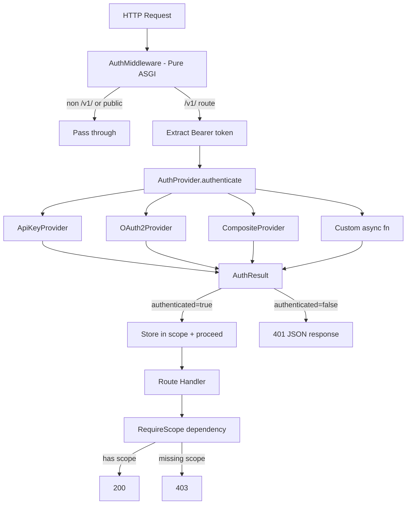

# Pluggable Authentication Providers

## Overview

Implement a pluggable authentication system for the Agent Gateway supporting API keys and OAuth2, following the same architectural pattern as the persistence layer: Domain types -> Protocol -> Null implementation -> Concrete providers -> Fluent Gateway API.

This replaces the current placeholder `ApiKeyAuthMiddleware` (which uses `BaseHTTPMiddleware`) with a pure ASGI middleware backed by pluggable auth providers.

## Problem Statement

The current auth implementation (`src/agent_gateway/api/auth.py`) has several limitations:

1. Uses `BaseHTTPMiddleware` — known issues with streaming, context vars, and buffering
2. Compares API keys via plain dict lookup (not timing-safe)
3. No scope enforcement — keys are validated but scopes are never checked per-endpoint
4. No support for OAuth2/JWT tokens
5. Not pluggable — tightly coupled to in-memory key dict
6. No `AuthResult` context passed to route handlers

## Proposed Solution

A layered auth architecture mirroring the persistence pattern:

```
Layer 1: Domain types         — AuthResult, ApiKeyRecord (plain dataclasses)
Layer 2: AuthProvider Protocol — authenticate(token) -> AuthResult
Layer 3: Null provider         — NullAuthProvider (always passes)
Layer 4: Concrete providers    — ApiKeyProvider, OAuth2Provider, CompositeProvider
Layer 5: Pure ASGI middleware  — AuthMiddleware orchestrates providers
Layer 6: Scope enforcement     — RequireScope FastAPI dependency
Layer 7: Fluent Gateway API    — use_api_keys(), use_oauth2(), use_auth()
```

## Technical Approach

### Architecture



### Implementation Phases

#### Phase 1: Domain Types and Protocols

Define the core types and contracts. Zero external dependencies.

**`src/agent_gateway/auth/__init__.py`**

```python
from agent_gateway.auth.domain import AuthResult
from agent_gateway.auth.protocols import AuthProvider

__all__ = ["AuthProvider", "AuthResult"]
```

**`src/agent_gateway/auth/domain.py`** — Plain dataclasses

```python
@dataclass(frozen=True)
class AuthResult:
    """Outcome of an authentication attempt."""
    authenticated: bool
    subject: str = ""
    scopes: list[str] = field(default_factory=list)
    auth_method: str = ""          # "api_key", "oauth2", "custom"
    claims: dict[str, Any] = field(default_factory=dict)
    error: str = ""

    @classmethod
    def ok(cls, subject: str, scopes: list[str], method: str, **claims: Any) -> AuthResult: ...

    @classmethod
    def denied(cls, error: str = "Access denied") -> AuthResult: ...


@dataclass
class ApiKeyRecord:
    """Stored API key (hashed, never plaintext)."""
    id: str
    name: str
    key_hash: str                  # SHA-256 hex digest
    key_prefix: str                # first 8 chars for identification
    scopes: list[str] = field(default_factory=lambda: ["*"])
    expires_at: datetime | None = None
    revoked: bool = False
    created_at: datetime | None = None
    last_used_at: datetime | None = None
```

**`src/agent_gateway/auth/protocols.py`** — Runtime-checkable Protocol

```python
@runtime_checkable
class AuthProvider(Protocol):
    """Contract for pluggable auth providers.

    Satisfied structurally (duck typing) — no inheritance required.
    """

    async def authenticate(self, token: str) -> AuthResult:
        """Validate a bearer token and return an AuthResult."""
        ...

    async def close(self) -> None:
        """Release resources (HTTP clients, DB connections, etc.)."""
        ...
```

**`src/agent_gateway/auth/null.py`** — Null implementation

```python
class NullAuthProvider:
    """No-op auth provider — used when auth is disabled."""

    async def authenticate(self, token: str) -> AuthResult:
        return AuthResult.ok(subject="anonymous", scopes=["*"], method="none")

    async def close(self) -> None:
        pass
```

- [ ] `AuthResult` frozen dataclass with `ok()` / `denied()` factory methods
- [ ] `ApiKeyRecord` dataclass for persisted keys
- [ ] `AuthProvider` Protocol with `authenticate()` and `close()`
- [ ] `NullAuthProvider` no-op implementation
- [ ] Unit tests for domain types

---

#### Phase 2: API Key Provider

In-memory API key validation using SHA-256 hashed keys with timing-safe comparison.

**`src/agent_gateway/auth/providers/__init__.py`**
**`src/agent_gateway/auth/providers/api_key.py`**

```python
class ApiKeyProvider:
    """Validates Bearer tokens against hashed API keys.

    Keys are stored as SHA-256 hashes. Comparison uses hmac.compare_digest
    to prevent timing attacks.
    """

    def __init__(self, keys: list[ApiKeyRecord]) -> None:
        self._keys = keys  # hashed key records

    async def authenticate(self, token: str) -> AuthResult:
        candidate_hash = hashlib.sha256(token.encode()).hexdigest()
        for key in self._keys:
            if key.revoked:
                continue
            if key.expires_at and key.expires_at < datetime.now(UTC):
                continue
            if hmac.compare_digest(candidate_hash, key.key_hash):
                return AuthResult.ok(
                    subject=key.name,
                    scopes=key.scopes,
                    method="api_key",
                )
        return AuthResult.denied("Invalid API key")

    async def close(self) -> None:
        pass
```

**Key design decisions:**
- SHA-256 (not bcrypt) — API keys are high-entropy machine tokens, not passwords. SHA-256 is fast and sufficient per OWASP guidance.
- `hmac.compare_digest` for constant-time comparison to prevent timing attacks.
- Keys are hashed at config load time, never stored in plaintext in memory.

**Config integration** — Extend `AuthConfig` to hash keys at load time:

```python
class AuthConfig(BaseModel):
    enabled: bool = True
    mode: str = "api_key"  # api_key | oauth2 | composite | custom | none
    api_keys: list[AuthKeyConfig] = Field(default_factory=list)
    oauth2: OAuth2Config | None = None
    public_paths: list[str] = Field(default_factory=lambda: ["/v1/health"])
```

- [ ] `ApiKeyProvider` with SHA-256 hashing and `hmac.compare_digest`
- [ ] Helper: `hash_api_key(raw: str) -> str` and `generate_api_key() -> tuple[str, str]`
- [ ] `${VAR}` environment variable resolution in config keys (fail loudly on undefined)
- [ ] Extend `AuthConfig` with `oauth2` and `public_paths` fields
- [ ] Unit tests: valid key, invalid key, expired key, revoked key, timing-safe comparison

---

#### Phase 3: OAuth2 Provider

JWT validation against an OAuth2/OIDC provider's JWKS endpoint.

**`src/agent_gateway/auth/providers/oauth2.py`**

```python
class OAuth2Provider:
    """Validates JWT access tokens using JWKS from an OAuth2/OIDC provider.

    Requires: pip install agent-gateway[oauth2]
    """

    def __init__(
        self,
        issuer: str,
        audience: str,
        jwks_uri: str | None = None,
        algorithms: list[str] | None = None,
        scope_claim: str = "scope",
        clock_skew_seconds: int = 30,
    ) -> None:
        try:
            import jwt  # noqa: F401 — PyJWT
        except ImportError:
            raise ImportError(
                "OAuth2 provider requires the oauth2 extra: "
                "pip install agent-gateway[oauth2]"
            ) from None

        self._issuer = issuer
        self._audience = audience
        self._jwks_uri = jwks_uri or f"{issuer.rstrip('/')}/.well-known/jwks.json"
        self._algorithms = algorithms or ["RS256", "ES256"]
        self._scope_claim = scope_claim
        self._clock_skew = clock_skew_seconds
        self._jwks_cache: _JWKSCache | None = None
        self._jwks_lock = asyncio.Lock()
        self._http = httpx.AsyncClient(timeout=10.0)

    async def authenticate(self, token: str) -> AuthResult:
        """Validate JWT: signature, expiry, issuer, audience, then extract scopes."""
        ...

    async def close(self) -> None:
        await self._http.aclose()
```

**JWKS caching strategy:**
- Cache JWKS keys with 1-hour TTL
- On signature verification failure, refresh JWKS once (handles key rotation)
- Use `asyncio.Lock` to prevent thundering herd on concurrent cache misses
- Stale cache used as fallback if JWKS endpoint is temporarily unreachable

**Security constraints:**
- Only allow asymmetric algorithms: `RS256`, `RS384`, `RS512`, `ES256`, `ES384`, `ES512`
- Explicitly reject `none` and `HS*` symmetric algorithms
- Require `exp`, `iss`, `aud` claims
- Support `nbf` (not-before) with configurable clock skew (default 30s)
- Require `kid` header for key matching

**Config model:**

```python
class OAuth2Config(BaseModel):
    issuer: str
    audience: str
    jwks_uri: str | None = None
    algorithms: list[str] = Field(default_factory=lambda: ["RS256", "ES256"])
    scope_claim: str = "scope"       # "scp" for Azure AD
    clock_skew_seconds: int = 30
```

**Library:** PyJWT 2.x (lightweight, actively maintained). NOT python-jose (abandoned).

- [ ] `OAuth2Provider` with JWKS fetching, caching, and JWT validation
- [ ] JWKS cache with TTL + retry-on-failure + lock for concurrent access
- [ ] Algorithm allowlist (reject `none`, `HS*`)
- [ ] Clock skew tolerance for `exp`/`nbf`
- [ ] `OAuth2Config` Pydantic model
- [ ] Add `oauth2` optional dependency to `pyproject.toml`: `PyJWT[crypto]`, `httpx`
- [ ] Unit tests: valid JWT, expired JWT, wrong issuer, wrong audience, JWKS failure, key rotation

---

#### Phase 4: Composite Provider

Chain multiple providers — first success wins.

**`src/agent_gateway/auth/providers/composite.py`**

```python
class CompositeProvider:
    """Tries multiple auth providers in order. First authenticated result wins.

    A 401 (authentication failure) triggers fallback to the next provider.
    A 403 (valid credentials, wrong scope) is NOT retried — scopes are
    checked downstream, not by the provider.
    """

    def __init__(self, providers: list[AuthProvider]) -> None:
        self._providers = providers

    async def authenticate(self, token: str) -> AuthResult:
        last_error = "No auth providers configured"
        for provider in self._providers:
            result = await provider.authenticate(token)
            if result.authenticated:
                return result
            last_error = result.error or last_error
        return AuthResult.denied(last_error)

    async def close(self) -> None:
        for provider in self._providers:
            await provider.close()
```

- [ ] `CompositeProvider` with ordered provider chain
- [ ] Error aggregation: return last provider's error message
- [ ] `close()` disposes all child providers
- [ ] Unit tests: fallback behavior, first-match wins, all-fail returns last error

---

#### Phase 5: Pure ASGI Middleware

Replace the current `BaseHTTPMiddleware` implementation.

**`src/agent_gateway/auth/middleware.py`**

```python
class AuthMiddleware:
    """Pure ASGI auth middleware — no BaseHTTPMiddleware dependency.

    Responsibilities:
    1. Extract Bearer token from Authorization header
    2. Delegate to AuthProvider for token validation
    3. Store AuthResult in scope["auth"] for downstream access
    4. Return 401/403 JSON errors for failed auth
    5. Skip auth for non-/v1/ paths and configured public paths
    """

    def __init__(
        self,
        app: ASGIApp,
        provider: AuthProvider,
        public_paths: frozenset[str] = frozenset({"/v1/health"}),
    ) -> None:
        self.app = app
        self.provider = provider
        self.public_paths = public_paths

    async def __call__(self, scope: Scope, receive: Receive, send: Send) -> None:
        if scope["type"] != "http":
            await self.app(scope, receive, send)
            return

        path = scope.get("path", "")

        # Custom routes and public paths bypass auth
        if not path.startswith("/v1/") or path in self.public_paths:
            await self.app(scope, receive, send)
            return

        token = self._extract_bearer_token(scope)
        if token is None:
            await self._send_error(send, 401, "auth_required",
                "Missing or invalid Authorization header. Expected: Bearer <token>")
            return

        result = await self.provider.authenticate(token)
        if not result.authenticated:
            await self._send_error(send, 401, "invalid_credentials",
                result.error or "Invalid credentials")
            return

        # Store auth context for downstream handlers
        scope["auth"] = result
        await self.app(scope, receive, send)
```

**Error responses** include `WWW-Authenticate: Bearer` header per RFC 6750.

**Accessing auth in route handlers** via FastAPI dependency:

```python
# src/agent_gateway/auth/dependencies.py

def get_auth(request: Request) -> AuthResult:
    """FastAPI dependency to extract auth context from ASGI scope."""
    auth = request.scope.get("auth")
    if auth is None:
        raise HTTPException(status_code=401, detail="Not authenticated")
    return auth
```

- [ ] Pure ASGI `AuthMiddleware` (no `BaseHTTPMiddleware`)
- [ ] Bearer token extraction from raw ASGI headers
- [ ] `scope["auth"]` storage for downstream access
- [ ] `WWW-Authenticate: Bearer` header on 401 responses
- [ ] JSON error responses matching existing `error_response()` format
- [ ] `get_auth()` FastAPI dependency
- [ ] Delete old `src/agent_gateway/api/auth.py`
- [ ] Unit tests: public path bypass, custom route bypass, missing header, invalid token, valid token

---

#### Phase 6: Scope Enforcement

Scope checking as a FastAPI dependency, applied per-route.

**`src/agent_gateway/auth/scopes.py`**

```python
class RequireScope:
    """FastAPI dependency that checks caller scopes against required scopes.

    Usage:
        @router.post("/v1/agents/{agent_id}/invoke",
                      dependencies=[Depends(RequireScope("agents:invoke"))])
    """

    def __init__(self, *required: str) -> None:
        self._required = set(required)

    async def __call__(self, request: Request) -> None:
        auth: AuthResult = request.scope.get("auth")
        if auth is None:
            raise HTTPException(status_code=401, detail="Not authenticated")

        granted = set(auth.scopes)
        if "*" in granted:
            return

        # Check agent-specific scopes: agents:invoke:underwriting
        # matches agents:invoke requirement for agent_id=underwriting
        ...

        missing = self._required - granted
        if missing:
            raise HTTPException(status_code=403,
                detail=f"Insufficient scopes. Missing: {sorted(missing)}")
```

**Endpoint-to-scope mapping:**

| Endpoint | Required Scope |
|---|---|
| `POST /v1/agents/{id}/invoke` | `agents:invoke` or `agents:invoke:{agent_id}` |
| `POST /v1/agents/{id}/chat` | `agents:invoke` |
| `GET /v1/agents`, `GET /v1/agents/{id}` | `agents:read` |
| `GET /v1/executions/{id}` | `executions:read` |
| `POST /v1/executions/{id}/cancel` | `executions:cancel` |
| `GET /v1/sessions/*` | `sessions:read` |
| `DELETE /v1/sessions/{id}` | `sessions:manage` |
| `GET /v1/skills`, `GET /v1/tools` | `agents:read` |
| `POST /v1/reload` | `admin` |
| `GET /v1/health` | (public — no auth) |

**Scope hierarchy:**
- `*` — grants all scopes (superuser)
- `agents:invoke` — invoke any agent
- `agents:invoke:{agent_id}` — invoke specific agent only
- `agents:read` — read agent/skill/tool metadata
- `executions:read` — read execution results
- `executions:cancel` — cancel running executions
- `sessions:read` — list/get chat sessions
- `sessions:manage` — delete chat sessions
- `admin` — system operations (reload, etc.)

- [ ] `RequireScope` dependency with wildcard and agent-specific scope support
- [ ] Apply `RequireScope` to all existing route handlers
- [ ] Unit tests: wildcard, specific scope, missing scope, agent-specific scope

---

#### Phase 7: Gateway Fluent API and Wiring

Fluent API on Gateway class, mirroring the persistence pattern.

**Changes to `src/agent_gateway/gateway.py`:**

```python
class Gateway(FastAPI):
    def __init__(
        self,
        workspace: str | Path = "./workspace",
        auth: bool | Callable[..., Any] | AuthProvider = True,  # extended type
        reload: bool = False,
        **fastapi_kwargs: Any,
    ) -> None:
        ...
        self._auth_setting = auth       # raw constructor value
        self._auth_provider: AuthProvider | None = None  # set by fluent API

    # --- Auth configuration (fluent API) ---

    def use_api_keys(
        self,
        keys: list[dict[str, Any]],
    ) -> Gateway:
        """Configure API key authentication.

        Args:
            keys: List of {"name": ..., "key": ..., "scopes": [...]} dicts.
                  Keys are hashed immediately; plaintext is not retained.
        """
        if self._started:
            raise RuntimeError("Cannot configure auth after gateway has started")
        from agent_gateway.auth.providers.api_key import ApiKeyProvider
        from agent_gateway.auth.domain import ApiKeyRecord
        records = [_hash_key_config(k) for k in keys]
        self._auth_provider = ApiKeyProvider(records)
        return self

    def use_oauth2(
        self,
        issuer: str,
        audience: str,
        jwks_uri: str | None = None,
        algorithms: list[str] | None = None,
        scope_claim: str = "scope",
    ) -> Gateway:
        """Configure OAuth2/OIDC JWT validation.

        Requires: pip install agent-gateway[oauth2]
        """
        if self._started:
            raise RuntimeError("Cannot configure auth after gateway has started")
        from agent_gateway.auth.providers.oauth2 import OAuth2Provider
        self._auth_provider = OAuth2Provider(
            issuer=issuer, audience=audience,
            jwks_uri=jwks_uri, algorithms=algorithms,
            scope_claim=scope_claim,
        )
        return self

    def use_auth(self, provider: AuthProvider | None) -> Gateway:
        """Configure a custom auth provider, or None to disable auth."""
        if self._started:
            raise RuntimeError("Cannot configure auth after gateway has started")
        self._auth_provider = provider
        return self
```

**Precedence:** Fluent API > constructor `auth=` param > `gateway.yaml` config.

**Startup wiring in `_startup()`:**

```python
# Replace current auth wiring (lines 287-291) with:
auth_provider = self._resolve_auth_provider()
if auth_provider is not None:
    from agent_gateway.auth.middleware import AuthMiddleware
    public = frozenset(self._config.auth.public_paths) if self._config else frozenset({"/v1/health"})
    self.add_middleware(AuthMiddleware, provider=auth_provider, public_paths=public)
```

**Shutdown:** call `auth_provider.close()` in `_shutdown()`.

- [ ] `use_api_keys()`, `use_oauth2()`, `use_auth()` fluent methods
- [ ] `_resolve_auth_provider()` with precedence: fluent > constructor > config
- [ ] Extend `Gateway.__init__` `auth` param to accept `bool | Callable | AuthProvider`
- [ ] Custom auth callable wrapped into an adapter: `CallableAuthProvider`
- [ ] Wire `AuthMiddleware` in `_startup()`, dispose in `_shutdown()`
- [ ] Remove old auth middleware wiring
- [ ] Integration tests with `httpx.AsyncClient` + `ASGITransport`

---

### `${VAR}` Environment Variable Resolution

Add a config utility to resolve `${VAR}` placeholders in YAML values at load time.

**`src/agent_gateway/config.py`** — extend `from_yaml()`:

```python
def _resolve_env_vars(data: dict) -> dict:
    """Recursively resolve ${VAR} placeholders from environment.

    Raises ValueError if a referenced variable is undefined.
    """
    ...
```

- [ ] `_resolve_env_vars()` in config loader
- [ ] Fail loudly on undefined env vars (prevents empty-string keys)
- [ ] Unit tests: resolution, missing var error, nested dicts, lists

---

## File Structure

```
src/agent_gateway/auth/
    __init__.py              # Public exports: AuthProvider, AuthResult
    domain.py                # AuthResult, ApiKeyRecord dataclasses
    protocols.py             # AuthProvider Protocol
    null.py                  # NullAuthProvider
    middleware.py             # Pure ASGI AuthMiddleware
    scopes.py                # RequireScope dependency
    dependencies.py           # get_auth() FastAPI dependency
    providers/
        __init__.py
        api_key.py           # ApiKeyProvider (in-memory hashed keys)
        oauth2.py            # OAuth2Provider (JWKS + JWT validation)
        composite.py         # CompositeProvider (chain of providers)

tests/test_auth/
    __init__.py
    test_domain.py           # AuthResult, ApiKeyRecord
    test_api_key_provider.py # ApiKeyProvider unit tests
    test_oauth2_provider.py  # OAuth2Provider with mocked JWKS
    test_composite.py        # CompositeProvider chain behavior
    test_middleware.py        # Pure ASGI middleware tests
    test_scopes.py           # RequireScope dependency tests
    test_integration.py      # Full Gateway integration (httpx + ASGITransport)
```

**Modified files:**
- `src/agent_gateway/gateway.py` — fluent API + startup wiring
- `src/agent_gateway/config.py` — extended AuthConfig + env var resolution
- `src/agent_gateway/api/routes/invoke.py` — add `RequireScope` dependency
- `src/agent_gateway/api/routes/chat.py` — add `RequireScope` dependency
- `src/agent_gateway/api/routes/executions.py` — add `RequireScope` dependency
- `src/agent_gateway/api/routes/introspection.py` — add `RequireScope` dependency
- `pyproject.toml` — add `oauth2` optional extra (`PyJWT[crypto]`)

**Deleted files:**
- `src/agent_gateway/api/auth.py` — replaced by `src/agent_gateway/auth/middleware.py`

## Acceptance Criteria

### Functional Requirements

- [ ] `/v1/` routes require valid Bearer token when auth is enabled
- [ ] API key validation uses SHA-256 hashing with timing-safe comparison
- [ ] OAuth2 JWT validation against JWKS endpoint with caching
- [ ] Scopes enforced per endpoint via `RequireScope` dependency
- [ ] `*` scope grants access to all endpoints
- [ ] Agent-specific scopes work (`agents:invoke:underwriting`)
- [ ] Custom routes (non-`/v1/`) bypass auth completely
- [ ] Configurable public paths bypass auth (default: `/v1/health`)
- [ ] Composite auth: multiple providers tried in order
- [ ] Custom auth: `Gateway(auth=my_async_fn)` works
- [ ] Auth disabled: `Gateway(auth=False)` or `auth.mode: none`
- [ ] `${VAR}` env resolution in YAML API keys (fail on undefined)

### Non-Functional Requirements

- [ ] Pure ASGI middleware (no `BaseHTTPMiddleware`)
- [ ] Follows persistence layer architecture pattern exactly
- [ ] `AuthProvider` is a `@runtime_checkable Protocol` (structural typing)
- [ ] OAuth2 dependencies are optional (`pip install agent-gateway[oauth2]`)
- [ ] JWKS cache prevents per-request HTTP calls (1h TTL + refresh on failure)
- [ ] `WWW-Authenticate: Bearer` header on 401 responses (RFC 6750)

### Quality Gates

- [ ] All existing tests pass (no regressions)
- [ ] New unit tests for each provider, middleware, and scope checker
- [ ] Integration tests with `httpx.AsyncClient` + `ASGITransport`
- [ ] `ruff` and `mypy --strict` pass
- [ ] Auth failures logged to audit repository

## Dependencies & Prerequisites

- Phase 08 (Gateway + API routes) — already complete
- Persistence layer — already complete (used for audit logging)
- **New pip dependency:** `PyJWT[crypto]` (optional, for OAuth2)
- `httpx` — already in deps (used for JWKS fetching)

## Risk Analysis & Mitigation

| Risk | Likelihood | Impact | Mitigation |
|---|---|---|---|
| JWT algorithm confusion attack (`alg: none`) | Low | Critical | Explicit algorithm allowlist, reject `none`/`HS*` |
| Timing attack on API key comparison | Medium | High | `hmac.compare_digest` for all comparisons |
| JWKS endpoint unavailable | Medium | High | Cache with stale fallback + circuit breaker |
| Empty API key from unresolved `${VAR}` | Low | Critical | Fail loudly on undefined env vars at startup |
| Breaking existing `request.state.auth_scopes` usage | Low | Medium | Clean replacement — current usage is internal only |

## References

### Internal References

- Persistence pattern reference: `src/agent_gateway/persistence/backend.py`
- Persistence domain types: `src/agent_gateway/persistence/domain.py`
- Current auth (to replace): `src/agent_gateway/api/auth.py`
- Auth middleware plan: `docs/plans/09-auth-middleware.md`
- Gateway fluent API: `src/agent_gateway/gateway.py:342-421`
- Config models: `src/agent_gateway/config.py:35-44`

### External References

- OWASP API Key Storage: SHA-256 sufficient for high-entropy machine tokens
- RFC 6750: Bearer Token Usage (WWW-Authenticate header requirements)
- PyJWT docs: https://pyjwt.readthedocs.io/
- Starlette pure ASGI middleware: https://www.starlette.io/middleware/
