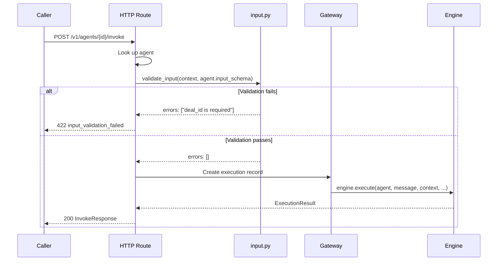
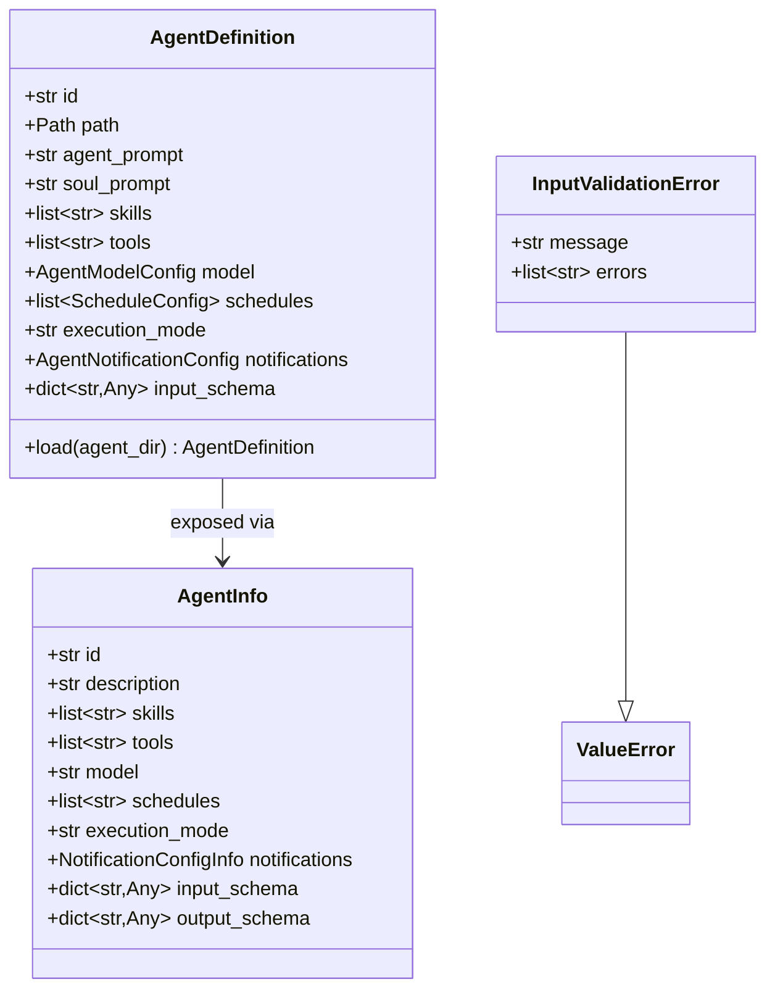

# feat: Add Agent Input Schema Validation

## Overview

Add `input_schema` support to agent definitions so that the `context` dict passed during invocation can be validated against a declared JSON Schema. This enables typed agent-to-agent interactions by making agent contracts (inputs + outputs) discoverable and enforceable.

Just as tools have parameter schemas that are validated before execution, agents should be able to declare what structured input they expect. The `message` field remains free-text (the instruction), while `context` becomes the typed, validated data payload.

## Problem Statement / Motivation

Today, agents accept an untyped `context: dict[str, Any]` with zero validation. This creates several problems:

1. **No discoverability** — A caller (human or agent) has no way to know what context fields an agent expects without reading its source.
2. **No validation** — Invalid context silently reaches the LLM, wasting tokens and producing unpredictable results.
3. **No agent-to-agent contracts** — For agents to invoke each other reliably, they need machine-readable contracts. Output schemas already exist; input schemas complete the picture.
4. **No documentation** — The OpenAPI spec and introspection API cannot describe what each agent expects as input.

## Proposed Solution

Add `input_schema` as a field on `AgentDefinition`, parsed from AGENT.md (or CONFIG.md) frontmatter as a JSON Schema dict. Support Pydantic BaseModel registration via a programmatic API. Validate `context` against the schema at invoke entry points (HTTP and programmatic). Expose the schema through the introspection API.

**Chat is explicitly excluded from validation.** Chat is a multi-turn, conversational interaction where the agent can ask for what it needs through dialogue. Enforcing upfront schema validation on chat context contradicts the purpose of a conversation — the first message might be "hello" with no structured data at all. Input schema validation applies only to the invoke path, which is single-shot and task-oriented, where the caller must provide everything upfront.

### Example: AGENT.md with input_schema

```yaml
---
tools:
  - underwrite-deal
input_schema:
  type: object
  properties:
    deal_id:
      type: string
      description: The deal identifier to underwrite
    amount:
      type: number
      description: Deal amount in USD
    customer_tier:
      type: string
      enum: [standard, premium, enterprise]
  required:
    - deal_id
    - amount
---

# Underwriting Agent

You are an underwriting agent. Use the provided context to assess the deal.
```

### Example: Invocation

```json
POST /v1/agents/underwriting/invoke
{
  "message": "Assess this deal for risk",
  "context": {
    "deal_id": "D-123",
    "amount": 50000,
    "customer_tier": "premium"
  }
}
```

### Example: Pydantic model registration (code-based)

```python
from pydantic import BaseModel

class UnderwritingInput(BaseModel):
    deal_id: str
    amount: float
    customer_tier: str = "standard"

gw = Gateway(workspace_dir="workspace")
gw.set_input_schema("underwriting", UnderwritingInput)
```

### Example: Agent-to-agent discovery

```json
GET /v1/agents/underwriting
{
  "id": "underwriting",
  "description": "You are an underwriting agent...",
  "skills": [],
  "tools": ["underwrite-deal"],
  "input_schema": {
    "type": "object",
    "properties": {
      "deal_id": { "type": "string", "description": "The deal identifier" },
      "amount": { "type": "number" }
    },
    "required": ["deal_id", "amount"]
  },
  "output_schema": null,
  "execution_mode": "sync"
}
```

## Technical Approach

### Architecture

The input schema feature touches four layers:

```
┌─────────────────────────────────────────────────────────┐
│  Layer 1: Definition & Parsing                          │
│  AgentDefinition.input_schema (agent.py)                │
│  Parsed from AGENT.md / CONFIG.md YAML frontmatter      │
│  Or registered via gw.set_input_schema() (Pydantic)     │
├─────────────────────────────────────────────────────────┤
│  Layer 2: Validation                                    │
│  New module: engine/input.py                            │
│  validate_input_context(context, schema) → errors       │
│  resolve_input_schema(schema) → (dict, model_cls?)      │
│  Mirrors engine/output.py pattern                       │
├─────────────────────────────────────────────────────────┤
│  Layer 3: Enforcement (invoke path only)                │
│  HTTP invoke route (api/routes/invoke.py)               │
│  Programmatic gw.invoke() (gateway.py)                  │
│  Schedule context at load time (agent.py)               │
│  Chat is excluded — agents gather input conversationally│
├─────────────────────────────────────────────────────────┤
│  Layer 4: Exposure                                      │
│  Introspection API — AgentInfo.input_schema             │
│  GET /v1/agents, GET /v1/agents/{id}                    │
└─────────────────────────────────────────────────────────┘
```

### Key Design Decisions

1. **Schema validates `context` only** — `message` remains free-text. This mirrors the tool pattern where the function description is free-text and parameters are structured.

2. **CONFIG.md wins for `input_schema` (scalar precedence)** — Consistent with `model`, `execution_mode`. No schema merging. If CONFIG.md defines `input_schema`, it replaces AGENT.md's entirely.

3. **Pydantic support via programmatic API only** — AGENT.md is YAML and cannot reference Python classes. Pydantic BaseModel support is available via `gw.set_input_schema(agent_id, MyModel)`. The resolved JSON Schema dict is what gets stored and exposed.

4. **Invoke-only validation — chat is excluded** — Input schema validation applies only to the invoke path (HTTP + programmatic). Chat endpoints are conversational by nature — the agent can ask the user for missing information through dialogue. Enforcing upfront schema validation on chat would be unnecessarily rigid and contradicts the multi-turn interaction model.

5. **Validation at entry points, not in the engine** — Input validation happens before execution starts (no execution record created, no tokens consumed). This is fundamentally different from output validation which happens after LLM completion.

6. **HTTP 422 for validation failures** — Consistent with FastAPI's Pydantic validation convention. Error code: `input_validation_failed`.

7. **No schema = no validation (backward compatible)** — Agents without `input_schema` accept any context, preserving existing behavior.

8. **Schedule context validated at load time** — Catches misconfigurations early instead of failing every cron fire.

9. **OpenAPI per-agent schemas deferred** — The introspection API is sufficient for programmatic discovery. Dynamic OpenAPI schema generation per agent is a follow-up.

### Implementation Phases

#### Phase 1: Data Model & Parsing

**Files modified:**
- `src/agent_gateway/workspace/agent.py`
- `src/agent_gateway/api/models.py`

**Tasks:**

1. Add `input_schema: dict[str, Any] | None = None` field to `AgentDefinition` dataclass (agent.py:39)

2. Extract `input_schema` from frontmatter in `AgentDefinition.load()` (agent.py:56-129):
   ```python
   # Scalar precedence: CONFIG.md wins
   input_schema_raw = config_meta.get("input_schema") or agent_meta.get("input_schema")
   ```

3. Validate the schema itself at load time using `jsonschema.Draft202012Validator.check_schema()`. Log warning and set to `None` if invalid (don't crash the loader).

4. Add `input_schema: dict[str, Any] | None = None` and `output_schema: dict[str, Any] | None = None` to `AgentInfo` Pydantic model (api/models.py:112-122)

5. Validate schedule contexts against `input_schema` at load time. In `AgentDefinition.load()`, after parsing both `input_schema` and `schedules`, validate each schedule's `context` against the schema. Log warning for mismatches but still load the schedule (non-fatal).

**Success criteria:**
- `AgentDefinition.load()` correctly parses `input_schema` from AGENT.md and CONFIG.md
- Invalid schemas produce warnings, not crashes
- CONFIG.md `input_schema` overrides AGENT.md `input_schema`
- Schedule contexts are validated at load time

#### Phase 2: Validation Module

**Files created:**
- `src/agent_gateway/engine/input.py`

**Files modified:**
- `src/agent_gateway/engine/__init__.py` (if needed)

**Tasks:**

1. Create `engine/input.py` mirroring the `engine/output.py` pattern:

   ```python
   # src/agent_gateway/engine/input.py

   def resolve_input_schema(
       schema: dict[str, Any] | type[BaseModel],
   ) -> tuple[dict[str, Any], type[BaseModel] | None]:
       """Normalize input schema to (json_schema_dict, optional model class)."""

   def validate_input(
       context: dict[str, Any] | None,
       schema: dict[str, Any],
   ) -> list[str]:
       """Validate context against JSON Schema. Returns list of error messages."""

   def validate_input_pydantic(
       context: dict[str, Any] | None,
       model_cls: type[BaseModel],
   ) -> list[str]:
       """Validate context against Pydantic model. Returns list of error messages."""
   ```

2. Handle edge cases:
   - `context` is `None` and schema has required fields → error
   - `context` is `None` and schema has no required fields → valid (empty object)
   - `context` is `{}` and schema has required fields → error (missing fields)

**Success criteria:**
- `validate_input()` correctly validates context dicts against JSON Schemas
- `validate_input_pydantic()` correctly validates via Pydantic model
- `resolve_input_schema()` handles both dict and BaseModel inputs
- Edge cases for None/empty context are handled

#### Phase 3: Enforcement at Invoke Entry Points

**Files modified:**
- `src/agent_gateway/api/routes/invoke.py`
- `src/agent_gateway/gateway.py`

**Not modified (intentionally):**
- `src/agent_gateway/api/routes/chat.py` — Chat is conversational; the agent gathers what it needs through dialogue. No upfront schema validation.
- `gateway.py:gw.chat()` — Same reasoning. Chat context is supplementary, not contractual.

**Tasks:**

1. **HTTP invoke route** (invoke.py) — Add validation after agent lookup, before execution record creation:
   ```python
   # After agent lookup, before execution_id generation
   if agent.input_schema:
       errors = validate_input(body.context, agent.input_schema)
       if errors:
           return error_response(
               422, "input_validation_failed",
               f"Context validation failed: {'; '.join(errors)}"
           )
   ```

2. **Programmatic `gw.invoke()`** (gateway.py:1122) — Add validation before engine.execute():
   ```python
   if agent.input_schema:
       errors = validate_input(context, agent.input_schema)
       if errors:
           raise InputValidationError(
               f"Context validation failed for agent '{agent_id}': {'; '.join(errors)}"
           )
   ```

3. **Create `InputValidationError`** — New exception in `src/agent_gateway/exceptions.py` (or a new file if it doesn't exist):
   ```python
   class InputValidationError(ValueError):
       """Raised when input context fails schema validation."""
       def __init__(self, message: str, errors: list[str] | None = None):
           super().__init__(message)
           self.errors = errors or []
   ```

**Design rationale — why chat is excluded:**

| | Invoke | Chat |
|---|---|---|
| Interaction model | Single-shot, task-oriented | Multi-turn, conversational |
| Caller provides | Everything upfront | Incrementally, through dialogue |
| Missing data | Fails fast (422) | Agent asks for it |
| Schema enforcement | Yes — it's a contract | No — agent handles it |
| `context` role | Structured input payload | Optional supplementary hints |

**Success criteria:**
- Invalid context returns HTTP 422 before any execution starts
- No execution record is created for validation failures
- No LLM tokens are consumed for validation failures
- Programmatic callers get `InputValidationError` with structured error details
- Agents without `input_schema` continue to work unchanged
- Chat endpoints accept any context regardless of `input_schema`

#### Phase 4: Introspection API

**Files modified:**
- `src/agent_gateway/api/routes/introspection.py`
- `src/agent_gateway/api/models.py`

**Tasks:**

1. Update `list_agents()` and `get_agent()` in introspection.py to include `input_schema`:
   ```python
   AgentInfo(
       id=agent.id,
       ...,
       input_schema=agent.input_schema,
   )
   ```

2. Ensure `AgentInfo.input_schema` serializes correctly (Pydantic handles `dict[str, Any] | None` natively).

**Success criteria:**
- `GET /v1/agents` returns `input_schema` for each agent
- `GET /v1/agents/{id}` returns `input_schema`
- Agents without input_schema return `null`

#### Phase 5: Programmatic Registration API (Pydantic Support)

**Files modified:**
- `src/agent_gateway/gateway.py`

**Tasks:**

1. Add `gw.set_input_schema(agent_id, schema)` method:
   ```python
   def set_input_schema(
       self,
       agent_id: str,
       schema: dict[str, Any] | type[BaseModel],
   ) -> None:
       """Set the input schema for an agent.

       Can be called with a JSON Schema dict or a Pydantic BaseModel class.
       Must be called before startup() or after reload().
       """
   ```

2. Store the resolved schema. If a Pydantic model is provided, call `resolve_input_schema()` to get the JSON Schema dict and keep a reference to the model class for validation.

3. The programmatic schema overrides the AGENT.md frontmatter schema (code wins over config, consistent with code tools overriding file tools).

4. Handle the timing issue: `set_input_schema()` is called before `startup()` loads the workspace. The schema needs to be applied after workspace loading. Use a pending registry pattern (similar to how `@gw.tool()` registers before startup):
   ```python
   # Store pending schemas before startup
   self._pending_input_schemas: dict[str, dict[str, Any] | type[BaseModel]] = {}

   # Apply after workspace load in _apply_code_registrations()
   ```

**Success criteria:**
- Pydantic BaseModel classes can be registered as input schemas
- Code-registered schemas override AGENT.md schemas
- `resolve_input_schema()` converts Pydantic to JSON Schema for introspection
- Validation uses the Pydantic model class when available (stronger validation)

## Acceptance Criteria

### Functional Requirements

- [x] Agents can declare `input_schema` in AGENT.md frontmatter as JSON Schema
- [x] Agents can declare `input_schema` in CONFIG.md frontmatter (overrides AGENT.md)
- [x] `context` is validated against `input_schema` at HTTP invoke endpoint (returns 422 on failure)
- [x] `context` is validated against `input_schema` in `gw.invoke()` (raises `InputValidationError`)
- [x] Chat endpoints (`/chat` and `gw.chat()`) do NOT validate context against `input_schema` — agents gather input conversationally
- [x] Agents without `input_schema` accept any context (backward compatible)
- [x] `GET /v1/agents` includes `input_schema` in response
- [x] `GET /v1/agents/{id}` includes `input_schema` in response
- [x] `gw.set_input_schema(agent_id, PydanticModel)` registers Pydantic-based schemas
- [x] `gw.set_input_schema(agent_id, dict)` registers raw JSON Schema dicts
- [x] Schedule context is validated against `input_schema` at workspace load time (warning, non-fatal)
- [x] Invalid `input_schema` definitions in frontmatter produce load-time warnings, not crashes
- [x] No execution record is created when input validation fails
- [x] No LLM tokens are consumed when input validation fails

### Non-Functional Requirements

- [x] Validation adds < 1ms overhead per invocation (jsonschema is fast for typical schemas)
- [x] Existing test suites pass without modification
- [x] No breaking changes to existing API contracts

### Quality Gates

- [x] Unit tests for `engine/input.py` (valid, invalid, edge cases)
- [x] Unit tests for `AgentDefinition.load()` with `input_schema` parsing
- [x] Integration tests for HTTP 422 responses on invalid context (invoke)
- [x] Integration tests for programmatic validation errors (`gw.invoke()`)
- [ ] Test that chat endpoints skip input validation even when `input_schema` is defined
- [x] Test for backward compatibility (no schema = no validation)
- [x] Test for CONFIG.md override precedence
- [x] Test for Pydantic model registration and validation
- [x] Test for schedule context validation at load time

## Dependencies & Prerequisites

- `jsonschema` library (already a dependency, used by `engine/output.py`)
- No new external dependencies required

## Risk Analysis & Mitigation

| Risk | Likelihood | Impact | Mitigation |
|---|---|---|---|
| Breaking existing callers who send unexpected context | Low | Medium | No schema = no validation (backward compat). Only agents that opt-in get validation. |
| Schema in AGENT.md is itself invalid | Medium | Low | Validate schema at load time with `check_schema()`. Log warning, treat as no schema. |
| Pydantic vs JSON Schema validation inconsistencies | Medium | Low | Always resolve to JSON Schema for storage. Use Pydantic validation only when model class is available. Document `additionalProperties` behavior. |
| Performance impact from validation | Low | Low | jsonschema validation is O(schema_size), not O(data_size). Typical schemas validate in microseconds. |

## Future Considerations

1. **OpenAPI per-agent schemas** — Generate dynamic endpoints or custom OpenAPI schema overrides so each agent's `context` shape appears in Swagger UI.
2. **Output schema on AgentDefinition** — The same pattern should be applied to `output_schema` (currently request-time only). A follow-up task should add `output_schema` to AGENT.md frontmatter parsing and introspection.
3. **Agent-to-agent invocation tool** — A built-in tool that lets Agent A invoke Agent B, passing validated context. The tool would auto-generate its parameter schema from Agent B's `input_schema`.
4. **Schema versioning** — Version negotiation for evolving schemas in agent-to-agent scenarios.
5. **`agw check` CLI validation** — A CLI command that validates all schedule contexts against their agent input schemas (CI/CD use case).

## References & Research

### Internal References

- Agent definition model: `src/agent_gateway/workspace/agent.py:39-129`
- Output schema validation: `src/agent_gateway/engine/output.py:48-70`
- Schema resolution: `src/agent_gateway/engine/output.py:73-84`
- Tool parameter validation: `src/agent_gateway/engine/executor.py:529-543`
- API models: `src/agent_gateway/api/models.py:28-33` (InvokeRequest), `112-122` (AgentInfo)
- Introspection routes: `src/agent_gateway/api/routes/introspection.py:56-106`
- Invoke route: `src/agent_gateway/api/routes/invoke.py:92-238`
- Programmatic invoke: `src/agent_gateway/gateway.py:1122-1183`
- Schema from function: `src/agent_gateway/workspace/schema.py:21-60`

### External References

- JSON Schema specification: https://json-schema.org/specification
- jsonschema Python library: https://python-jsonschema.readthedocs.io/
- Pydantic model_json_schema: https://docs.pydantic.dev/latest/concepts/json_schema/




