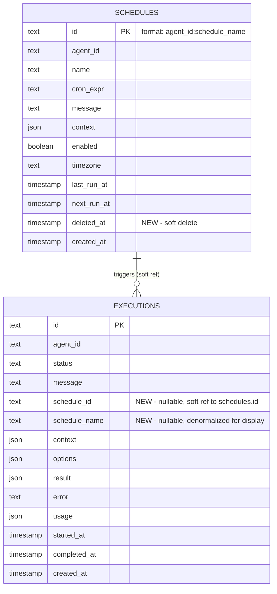

# feat: Cron Scheduling Engine

## Overview

Implement cron-based agent invocations using APScheduler 3.x (stable). Agents defined in the workspace can declare schedules in their CONFIG.md frontmatter. The scheduler registers these as cron jobs, invokes agents on schedule, and exposes a full API for listing, triggering, pausing, and resuming schedules. Each scheduled execution links back to its originating schedule for traceability.

The gateway exposes a top-level `timezone` configuration that serves as the default timezone for all scheduled jobs. Individual schedules can override this per-schedule.

Hot-reload of schedules (detecting CONFIG.md changes and updating jobs without restart) is deferred to a separate plan.

## Problem Statement / Motivation

Agents need to run on schedules — daily reports, weekly compliance scans, periodic health checks. Today, the only way to invoke an agent is via HTTP or programmatic `gw.invoke()`. Operators must set up external cron jobs or schedulers to hit the API, which adds operational complexity and loses the connection between the schedule definition and the execution.

This feature makes scheduling a first-class concept: define it alongside the agent, see it in the API, link executions back to their schedule, and manage it without leaving the gateway.

## Proposed Solution

Integrate APScheduler 3.x (stable, production-ready) into the Gateway lifecycle using `AsyncIOScheduler`. On startup, read `ScheduleConfig` entries from the workspace, register them as cron jobs, and dispatch executions through the existing queue/worker infrastructure. Expose schedule management via REST API and CLI.

## Technical Considerations

### Design Decisions

**Schedule ID scheme**: Deterministic composite `{agent_id}:{schedule_name}`. Stable across restarts, no UUID accumulation. Schedule names must be unique per agent (enforced at workspace load).

**Execution linking**: Add `schedule_id: str | None` column to `ExecutionRecord` and the `executions` SQL table. Soft reference (no FK constraint) so schedule deletion doesn't cascade. Indexed for efficient `GET /v1/schedules/{id}` execution history queries.

**Overlap prevention with queue-based execution**: The scheduler enqueues jobs to the existing worker pool (consistent architecture) but maintains a separate `_active_scheduled` set tracking in-flight schedule executions. The job handler checks this set before dispatching; the worker signals completion back. This ensures `max_instances=1` works even when execution is async.

**Gateway timezone**: The gateway exposes a top-level `timezone` setting in `gateway.yaml` (default `"UTC"`). This is the default timezone for all cron schedules. Individual schedules can override via their `timezone` field in CONFIG.md. The gateway timezone is also used for logging timestamps and API response formatting.

**No-persistence fallback**: When no DB is configured, APScheduler uses `MemoryJobStore`. Schedules still run but state is lost on restart. A prominent warning is logged.

**Misfire policy**: Coalesce misfired jobs (run once, not replay all missed). Default `misfire_grace_time=60s`, configurable in `gateway.yaml` under `scheduler:`.

**APScheduler 3.x (stable) over 4.x (alpha)**: APScheduler 4.x (`4.0.0a6`) is explicitly marked "do NOT use in production" — the schema and API may break between alpha releases with no migration path. APScheduler 3.x (`3.11.2`) is battle-tested, supports `AsyncIOScheduler` for asyncio coroutines, has `CronTrigger`, SQLAlchemy job stores, and full pause/resume/reschedule APIs. The dependency will be changed from `apscheduler>=4.0.0a1` to `apscheduler>=3.10,<4`. The scheduler engine wraps APScheduler behind a thin internal interface so it can be upgraded to v4 when it stabilizes.

### Architecture

```
Gateway._startup()
    │
    ├── (existing) Load workspace → WorkspaceState.schedules
    ├── (existing) Init persistence → schedules table created
    │
    └── [NEW] Step 9.5: Init Scheduler
          ├── Create APScheduler AsyncIOScheduler
          │     ├── SQLAlchemyJobStore (if persistence configured)
          │     └── MemoryJobStore (fallback)
          ├── Sync workspace schedules → ScheduleRecord in DB
          ├── Register cron jobs with APScheduler
          └── Start scheduler in background

APScheduler fires cron job
    │
    └── _run_scheduled_job()
          ├── Check _active_scheduled set (skip if already running)
          ├── Add to _active_scheduled
          ├── Create ExecutionRecord with schedule_id
          ├── Enqueue to worker pool (or invoke directly if no queue)
          └── On completion callback: remove from _active_scheduled,
              update ScheduleRecord.last_run_at

Gateway._shutdown()
    │
    ├── [NEW] Stop scheduler (prevents new fires)
    ├── (existing) Drain worker pool
    └── (existing) Dispose everything
```

### Execution Flow for Scheduled Jobs

```
CronTrigger fires
  → _run_scheduled_job(schedule_id, agent_id, message, context)
    → Check overlap: schedule_id in _active_scheduled? → skip + warn
    → Add schedule_id to _active_scheduled
    → If queue backend configured:
        → Enqueue ExecutionJob with context={"source": "scheduled", "schedule_id": ..., "schedule_name": ...}
        → Worker picks up, executes, fires notifications
        → Worker completion callback → remove from _active_scheduled, update last_run_at
    → If no queue (NullQueue):
        → Call gateway.invoke() directly (synchronous in scheduler context)
        → Remove from _active_scheduled, update last_run_at
    → On any exception: log, remove from _active_scheduled, continue
```

## Implementation Tasks

### 1. Gateway Timezone + Scheduler Config (`src/agent_gateway/config.py`)

Add `timezone` to `GatewayConfig` (top-level) and `SchedulerConfig` as a nested config:

```python
class SchedulerConfig(BaseModel):
    enabled: bool = True
    misfire_grace_seconds: int = 60
    max_instances: int = 1
    coalesce: bool = True

class GatewayConfig(BaseSettings):
    timezone: str = "UTC"  # IANA timezone name — default for all schedules
    scheduler: SchedulerConfig = SchedulerConfig()
    # ... existing fields
```

Parsed from `gateway.yaml`:

```yaml
timezone: "Europe/London"   # gateway-wide default

scheduler:
  enabled: true
  misfire_grace_seconds: 60
  max_instances: 1
  coalesce: true
```

Validate `timezone` is a valid IANA name at config load time via `zoneinfo.ZoneInfo(tz)`.

The timezone resolution order for a schedule is:
1. Per-schedule `timezone` in CONFIG.md (if set and not `"UTC"`)
2. Gateway-level `timezone` from `gateway.yaml`
3. Fallback: `"UTC"`

### 2. Cron Validation at Workspace Load (`src/agent_gateway/workspace/agent.py`)

Add validation in `AgentDefinition.load()` when parsing schedules:

```python
from apscheduler.triggers.cron import CronTrigger
from zoneinfo import ZoneInfo, ZoneInfoNotFoundError

# Resolve timezone: per-schedule > gateway default > UTC
tz = s.get("timezone", gateway_timezone or "UTC")
try:
    ZoneInfo(tz)  # validate IANA name
    CronTrigger.from_crontab(s["cron"], timezone=tz)
except (ValueError, KeyError, ZoneInfoNotFoundError) as e:
    logger.warning("Invalid schedule '%s' in %s: %s", s.get("name"), agent_dir, e)
    continue  # skip this schedule
```

Enforce schedule name uniqueness per agent at load time.

### 3. Schedule Repository Protocol (`src/agent_gateway/persistence/protocols.py`)

```python
@runtime_checkable
class ScheduleRepository(Protocol):
    async def upsert(self, record: ScheduleRecord) -> None: ...
    async def get(self, schedule_id: str) -> ScheduleRecord | None: ...
    async def list_all(self, agent_id: str | None = None) -> list[ScheduleRecord]: ...
    async def update_last_run(self, schedule_id: str, last_run_at: datetime, next_run_at: datetime | None) -> None: ...
    async def update_enabled(self, schedule_id: str, enabled: bool) -> None: ...
    async def soft_delete(self, schedule_id: str) -> None: ...
```

### 4. Schedule Repository SQL Implementation (`src/agent_gateway/persistence/backends/sql/repository.py`)

Implement `ScheduleRepository` using the existing `schedules` table. Add a `deleted_at` column to `ScheduleRecord` domain model and SQL table for soft deletes.

### 5. Null Schedule Repository (`src/agent_gateway/persistence/null.py`)

`NullScheduleRepository` — in-memory dict fallback for when persistence is disabled.

### 6. Execution-Schedule Linking

**Domain model** (`src/agent_gateway/persistence/domain.py`):
Add to `ExecutionRecord`:
```python
schedule_id: str | None = None
schedule_name: str | None = None
```

**SQL table** (`src/agent_gateway/persistence/backends/sql/base.py`):
Add columns to `executions` table:
```python
Column("schedule_id", String, nullable=True),
Column("schedule_name", String, nullable=True),
Index(f"ix_{prefix}executions_schedule_id", "schedule_id"),
```

**Execution Repository** (`src/agent_gateway/persistence/protocols.py`):
Add method:
```python
async def list_by_schedule(self, schedule_id: str, limit: int = 20) -> list[ExecutionRecord]: ...
```

### 7. Scheduler Engine (`src/agent_gateway/scheduler/engine.py`)

Core scheduler implementation:

```python
class SchedulerEngine:
    def __init__(
        self,
        gateway: Gateway,
        config: SchedulerConfig,
        schedule_repo: ScheduleRepository,
        data_store: DataStore | None = None,
    ) -> None: ...

    async def start(self, schedules: list[ScheduleConfig], agents: dict[str, AgentDefinition]) -> None:
        """Register schedules and start the APScheduler background loop."""

    async def stop(self) -> None:
        """Stop the scheduler gracefully."""

    async def pause(self, schedule_id: str) -> None: ...
    async def resume(self, schedule_id: str) -> None: ...
    async def trigger(self, schedule_id: str) -> str: ...  # returns execution_id
    async def get_schedules(self) -> list[ScheduleInfo]: ...
    async def get_schedule(self, schedule_id: str) -> ScheduleInfo | None: ...

    def on_execution_complete(self, schedule_id: str) -> None:
        """Callback from worker pool when a scheduled execution finishes."""
```

**Key internals:**
- `_active_scheduled: set[str]` — tracks in-flight schedule executions for overlap prevention
- `_schedule_configs: dict[str, ScheduleConfig]` — current schedule definitions (for message/context lookup at fire time)
- Uses `replace_existing=True` when adding jobs via `scheduler.add_job()` (handles restarts)
- APScheduler 3.x `AsyncIOScheduler` with `CronTrigger`, `SQLAlchemyJobStore` (or `MemoryJobStore`), and `coalesce=True`
- Gateway timezone passed as `scheduler.configure(timezone=gateway_tz)`

### 8. Module-Level Job Handler (`src/agent_gateway/scheduler/handler.py`)

APScheduler 3.x with `SQLAlchemyJobStore` serializes job references via pickle — the callable must be importable by module path. Use a module-level async function with a gateway reference set during scheduler start:

```python
# Module-level reference, set by SchedulerEngine.start()
_gateway_ref: Gateway | None = None

async def run_scheduled_job(
    schedule_id: str,
    agent_id: str,
    message: str,
    context: dict,
) -> None:
    """Entry point called by APScheduler. Dispatches to the gateway."""
    if _gateway_ref is None:
        logger.error("Scheduler handler called but gateway reference not set")
        return
    engine = _gateway_ref._scheduler
    if engine is not None:
        await engine.dispatch_scheduled_execution(schedule_id, agent_id, message, context)
```

### 9. Gateway Integration (`src/agent_gateway/gateway.py`)

**New instance variables:**
```python
self._scheduler: SchedulerEngine | None = None
self._schedule_repo: ScheduleRepository = NullScheduleRepository()
```

**Startup** (between step 9 and step 10):
```python
# 9.5: Init scheduler
if self._config.scheduler.enabled and workspace.schedules:
    from agent_gateway.scheduler.engine import SchedulerEngine

    job_store = self._build_scheduler_job_store()  # SQLAlchemyJobStore or MemoryJobStore
    self._scheduler = SchedulerEngine(
        gateway=self,
        config=self._config.scheduler,
        schedule_repo=self._schedule_repo,
        job_store=job_store,
        timezone=self._config.timezone,  # gateway-wide timezone
    )
    try:
        await self._scheduler.start(workspace.schedules, workspace.agents)
    except Exception:
        logger.warning("Failed to start scheduler", exc_info=True)
        self._scheduler = None
```

**Shutdown** (before worker pool drain):
```python
if self._scheduler is not None:
    await self._scheduler.stop()
    self._scheduler = None
```

**Worker pool completion hook**: When the worker pool finishes a scheduled execution, it calls `scheduler.on_execution_complete(schedule_id)` to remove it from `_active_scheduled` and update `last_run_at`.

### 10. Schedule API Routes (`src/agent_gateway/api/routes/schedules.py`)

| Endpoint | Method | Auth Scope | Description |
|---|---|---|---|
| `/v1/schedules` | GET | `schedules:read` | List all schedules. Supports `?agent_id=` filter |
| `/v1/schedules/{schedule_id}` | GET | `schedules:read` | Schedule details + recent executions |
| `/v1/schedules/{schedule_id}/run` | POST | `schedules:manage` | Manual trigger. Returns `{"execution_id": "...", "status": "queued"}` |
| `/v1/schedules/{schedule_id}/pause` | POST | `schedules:manage` | Pause schedule. Idempotent (200 if already paused) |
| `/v1/schedules/{schedule_id}/resume` | POST | `schedules:manage` | Resume schedule. Idempotent (200 if already resumed) |

**Response models** (`src/agent_gateway/api/models.py`):

```python
class ScheduleInfo(BaseModel):
    id: str
    agent_id: str
    name: str
    cron_expr: str
    enabled: bool
    timezone: str
    next_run_at: datetime | None
    last_run_at: datetime | None
    created_at: datetime | None

class ScheduleDetailInfo(ScheduleInfo):
    message: str
    context: dict[str, Any]
    recent_executions: list[ExecutionSummary]
```

### 11. Auth Scopes (`src/agent_gateway/auth/scopes.py`)

Add: `schedules:read`, `schedules:manage`. The wildcard `*` already grants all.

### 12. CLI Updates (`src/agent_gateway/cli/list_cmd.py`)

Update the existing `schedules` command to show next_run_at when available (reads from workspace files only — live state requires `--server-url` in a future phase).

### 13. Telemetry (`src/agent_gateway/telemetry/metrics.py`)

Add metrics:
- `agw.schedules.fires.total` (counter, by schedule_id + agent_id + status)
- `agw.schedules.active` (gauge — number of enabled schedules)

## Acceptance Criteria

- [x] Gateway-level `timezone` config in `gateway.yaml`, validated as IANA name
- [x] Per-schedule timezone falls back to gateway timezone, then to UTC
- [x] Schedules parsed from CONFIG.md with cron + timezone validation at load time
- [x] Invalid cron expressions produce workspace warnings, not crashes
- [x] APScheduler 3.x `AsyncIOScheduler` starts during Gateway lifespan, stops on shutdown
- [x] Dependency changed from `apscheduler>=4.0.0a1` to `apscheduler>=3.10,<4`
- [x] Scheduled jobs create standard execution records with `schedule_id` linkage
- [x] `GET /v1/schedules` lists all schedules with next_run_at, last_run_at, enabled
- [x] `GET /v1/schedules/{id}` returns schedule details + recent executions
- [x] `POST /v1/schedules/{id}/trigger` manually triggers a schedule, returns execution_id
- [x] `POST /v1/schedules/{id}/pause` and `/resume` work and are idempotent
- [x] Overlapping runs prevented: same schedule won't fire while previous is still executing
- [x] Misfire handling: coalesce to single run within grace window on restart
- [x] No persistence configured: scheduler falls back to MemoryJobStore with warning
- [x] Scheduler failure on startup: logged, gateway continues without schedules
- [x] Scheduled execution failures don't affect other schedules
- [x] Shutdown order: scheduler stops before worker pool drains
- [x] `ScheduleRepository` protocol with SQL + Null implementations
- [x] Auth scopes `schedules:read` and `schedules:manage` enforced on routes
- [ ] CLI `agent-gateway schedules` shows schedule listing from workspace files

## Dependencies & Risks

| Risk | Impact | Mitigation |
|---|---|---|
| APScheduler 3.x eventual EOL when v4 stabilizes | Low — v3 is mature, actively maintained | Wrapped behind `SchedulerEngine` interface; swap to v4 later |
| SQLAlchemyJobStore uses pickle serialization | Medium — security risk if DB is compromised | Only store trusted callables; job store is internal-only |
| Dual state (APScheduler job store + gateway schedules table) | Medium — divergence | APScheduler is runtime truth for next_run_at; gateway table is truth for metadata + last_run_at |
| Queue dispatch + overlap tracking complexity | Medium — race conditions | Use asyncio Lock around `_active_scheduled` set mutations |
| Schema changes (new columns on executions) | Low — additive only | Nullable columns, no FK constraints, auto-create-tables handles it |

## Files to Create/Modify

**New files:**
- `src/agent_gateway/scheduler/engine.py` — Core scheduler engine
- `src/agent_gateway/scheduler/handler.py` — Module-level job handler (APScheduler requirement)
- `src/agent_gateway/api/routes/schedules.py` — Schedule API routes

**Modified files:**
- `pyproject.toml` — Change `apscheduler>=4.0.0a1` to `apscheduler>=3.10,<4`
- `src/agent_gateway/config.py` — Add `timezone` to `GatewayConfig`, add `SchedulerConfig`
- `src/agent_gateway/workspace/agent.py` — Add cron + timezone validation
- `src/agent_gateway/persistence/domain.py` — Add `deleted_at` to `ScheduleRecord`, `schedule_id`/`schedule_name` to `ExecutionRecord`
- `src/agent_gateway/persistence/protocols.py` — Add `ScheduleRepository` protocol
- `src/agent_gateway/persistence/backends/sql/base.py` — Add columns to executions table, `deleted_at` to schedules table
- `src/agent_gateway/persistence/backends/sql/repository.py` — Add `ScheduleRepository` implementation
- `src/agent_gateway/persistence/null.py` — Add `NullScheduleRepository`
- `src/agent_gateway/persistence/backend.py` — Expose `schedule_repo` on `PersistenceBackend`
- `src/agent_gateway/gateway.py` — Scheduler lifecycle, `_schedule_repo`, shutdown ordering
- `src/agent_gateway/api/models.py` — Add `ScheduleInfo`, `ScheduleDetailInfo`
- `src/agent_gateway/auth/scopes.py` — Add schedule scopes
- `src/agent_gateway/cli/list_cmd.py` — Update schedules display
- `src/agent_gateway/telemetry/metrics.py` — Add scheduler metrics
- `src/agent_gateway/queue/worker.py` — Add completion callback hook for scheduled executions
- `src/agent_gateway/scheduler/__init__.py` — Exports

**Test files:**
- `tests/test_scheduler/test_engine.py` — Scheduler lifecycle, job registration, overlap prevention
- `tests/test_scheduler/test_handler.py` — Job handler dispatch
- `tests/test_scheduler/test_cron_validation.py` — Cron + timezone validation
- `tests/test_api/test_schedules.py` — Schedule API routes
- `tests/test_persistence/test_schedule_repository.py` — ScheduleRepository CRUD

## ERD (Changes)



## References

### Internal
- Original plan: `docs/plans/12-scheduler-and-hot-reload.md`
- Parent plan: `docs/plans/2026-02-18-feat-agent-gateway-framework-plan.md`
- Queue protocol pattern: `src/agent_gateway/queue/protocol.py`
- Worker pool pattern: `src/agent_gateway/queue/worker.py`
- Gateway lifespan: `src/agent_gateway/gateway.py:217-467`
- Existing schedule parsing: `src/agent_gateway/workspace/agent.py:111-127`
- Existing ScheduleRecord: `src/agent_gateway/persistence/domain.py:60-74`
- Test project schedule: `examples/test-project/workspace/agents/scheduled-reporter/AGENT.md`

### External
- [APScheduler 3.x Docs](https://apscheduler.readthedocs.io/en/3.x/)
- [APScheduler 3.x User Guide](https://apscheduler.readthedocs.io/en/3.x/userguide.html)
- [APScheduler GitHub](https://github.com/agronholm/apscheduler)
- APScheduler 3.x key APIs: `AsyncIOScheduler`, `CronTrigger` (with `from_crontab()`), `SQLAlchemyJobStore`, `add_job(replace_existing=True)`, `pause_job()`, `resume_job()`, `get_job()`, `get_jobs()`
