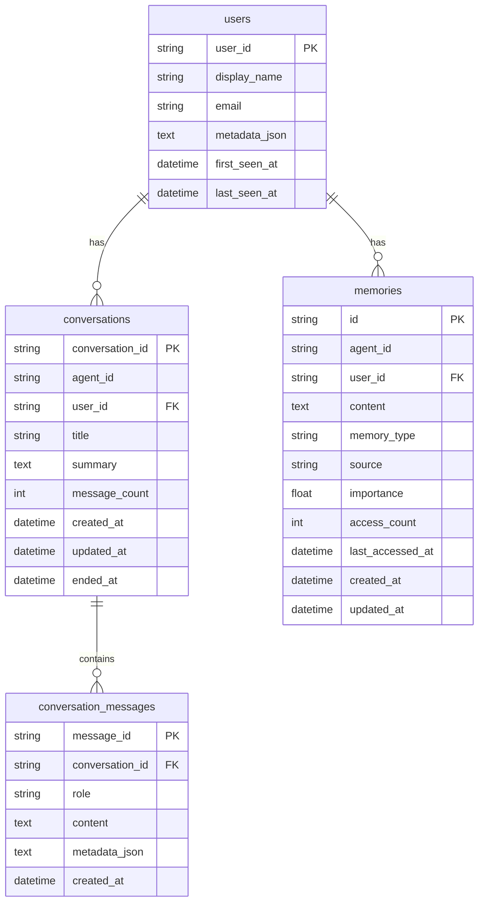

# Multi-User Memory & Conversation Persistence

## Overview

Transform Agent Gateway from a single-user, ephemeral-session system into a multi-user platform with persistent conversations and layered memory. In corporate SSO environments, each authenticated user gets their own conversation history, user profile, and per-user memories — in addition to shared global agent memory. Memory compaction prevents unbounded growth using a hybrid approach (time decay + relevance scoring + LLM summarization).

## Problem Statement

1. **Conversations are ephemeral.** `SessionStore` is in-memory with 30-min TTL. Server restart = total loss. The spec requires conversations MUST always be stored.
2. **No user dimension.** Auth middleware sets `AuthResult` on the request scope but it's never read downstream. `ChatSession` has no `user_id`. All users share sessions and memories.
3. **Memory is agent-only.** `MemoryRecord` is keyed by `agent_id` only. User A's travel preferences leak to User B.
4. **No compaction.** `MemorySource.COMPACTED` exists as an enum value but no compaction logic is implemented. Memories grow unboundedly.

## Proposed Solution

### Architecture

```
┌─────────────────────────────────────────────────────┐
│                   HTTP Layer                         │
│  AuthMiddleware → AuthResult(subject, claims)        │
└──────────────────────┬──────────────────────────────┘
                       │ auth context threaded down
┌──────────────────────▼──────────────────────────────┐
│                  Chat Layer                           │
│  gateway.chat(agent_id, message, auth=AuthResult)    │
│  SessionStore (in-memory cache + DB write-behind)    │
└──────────────────────┬──────────────────────────────┘
                       │
        ┌──────────────┴──────────────┐
        ▼                             ▼
┌───────────────┐          ┌──────────────────┐
│  Conversation │          │  Memory Layer     │
│  Persistence  │          │                   │
│               │          │  ┌─────────────┐  │
│  - messages   │          │  │ Global Agent │  │
│  - summaries  │          │  │   Memory     │  │
│               │          │  └─────────────┘  │
│               │          │  ┌─────────────┐  │
│               │          │  │  Per-User    │  │
│               │          │  │ Agent Memory │  │
│               │          │  └─────────────┘  │
└───────────────┘          └──────────────────┘
```

### Multi-User Scoping Rules

| Auth Method | User Identity | Conversation Scope | Memory Scope |
|---|---|---|---|
| OAuth2/SSO | JWT `sub` claim | Per-user | Global + per-user |
| API Key | `"api_key:{key_name}"` | Shared | Global only |
| No Auth | `"anonymous"` | Shared | Global only |
| Dashboard SSO | OIDC `sub` claim | Per-user | Global + per-user |
| Dashboard Password | `"admin"` | Shared | Global only |

**Rule:** If `AuthResult.auth_method == "oauth2"`, the system operates in multi-user mode for that request. Otherwise, single-user/shared mode.

## Technical Approach

### Phase 1: User Identity & Profile

**Goal:** Thread user identity through the system and persist user profiles.

#### 1.1 Domain Model — `UserProfile`

```python
# src/agent_gateway/persistence/domain.py

@dataclass
class UserProfile:
    user_id: str                          # JWT sub claim
    display_name: str | None = None       # from claims (name, preferred_username)
    email: str | None = None              # from claims
    metadata: dict[str, Any] = field(default_factory=dict)  # extra claims
    first_seen_at: datetime | None = None
    last_seen_at: datetime | None = None
```

#### 1.2 SQL Table — `users`

```python
# src/agent_gateway/persistence/backends/sql/base.py (extend build_tables)

users = Table(
    f"{prefix}users",
    metadata,
    Column("user_id", String, primary_key=True),
    Column("display_name", String, nullable=True),
    Column("email", String, nullable=True),
    Column("metadata_json", Text, nullable=False, default="{}"),
    Column("first_seen_at", DateTime, nullable=True),
    Column("last_seen_at", DateTime, nullable=True),
)
```

#### 1.3 Repository — `UserRepository`

```python
# src/agent_gateway/persistence/protocols.py (extend)

class UserRepository(Protocol):
    async def upsert(self, profile: UserProfile) -> None: ...
    async def get(self, user_id: str) -> UserProfile | None: ...
    async def delete(self, user_id: str) -> None: ...
```

#### 1.4 Auto-Create on Auth

Add a `_ensure_user_profile()` helper called from chat/invoke route handlers. Extract `sub`, `name`/`preferred_username`, `email` from `AuthResult.claims`. Upsert on every request (updates `last_seen_at`, overwrites name/email if changed in IdP).

#### 1.5 Thread AuthResult Downstream

- Add `auth: AuthResult | None = None` parameter to `gateway.chat()` and `gateway.invoke()`
- Chat route handler reads `request.scope.get("auth")` and passes it through
- Populate `ToolContext.caller_identity` (already exists but never set) from `auth.subject`
- Add `user_id` derivation: `auth.subject` if OAuth2, else `None` (shared mode)

**Files to modify:**
- `src/agent_gateway/persistence/domain.py` — add `UserProfile`
- `src/agent_gateway/persistence/protocols.py` — add `UserRepository`
- `src/agent_gateway/persistence/backends/sql/base.py` — add `users` table
- `src/agent_gateway/persistence/backends/sql/repository.py` — add `SqlUserRepository`
- `src/agent_gateway/persistence/backend.py` — add `user_repo` property to `PersistenceBackend`
- `src/agent_gateway/persistence/null.py` — add `NullUserRepository`
- `src/agent_gateway/api/routes/chat.py` — read auth, call `_ensure_user_profile()`, pass to gateway
- `src/agent_gateway/api/routes/invoke.py` — same
- `src/agent_gateway/gateway.py` — add `auth` param to `chat()` and `invoke()`
- `src/agent_gateway/engine/models.py` — populate `ToolContext.caller_identity`

---

### Phase 2: Conversation Persistence

**Goal:** Store all conversations in the database. Full message history + LLM-generated summaries.

#### 2.1 Domain Models

```python
# src/agent_gateway/persistence/domain.py

@dataclass
class ConversationRecord:
    conversation_id: str              # same as session_id
    agent_id: str
    user_id: str | None               # NULL = shared/anonymous
    title: str | None = None          # auto-generated or user-set
    summary: str | None = None        # LLM-generated summary
    message_count: int = 0
    created_at: datetime | None = None
    updated_at: datetime | None = None
    ended_at: datetime | None = None  # when conversation concluded

@dataclass
class ConversationMessage:
    message_id: str
    conversation_id: str
    role: str                         # user, assistant, system, tool
    content: str
    metadata_json: str = "{}"         # tool calls, model info, etc.
    created_at: datetime | None = None
```

#### 2.2 SQL Tables

```python
# src/agent_gateway/persistence/backends/sql/base.py

conversations = Table(
    f"{prefix}conversations",
    metadata,
    Column("conversation_id", String, primary_key=True),
    Column("agent_id", String, nullable=False),
    Column("user_id", String, nullable=True),  # NULL = shared
    Column("title", String, nullable=True),
    Column("summary", Text, nullable=True),
    Column("message_count", Integer, default=0),
    Column("created_at", DateTime, nullable=True),
    Column("updated_at", DateTime, nullable=True),
    Column("ended_at", DateTime, nullable=True),
    Index(f"ix_{prefix}conversations_user_agent", "user_id", "agent_id"),
    Index(f"ix_{prefix}conversations_user", "user_id"),
)

conversation_messages = Table(
    f"{prefix}conversation_messages",
    metadata,
    Column("message_id", String, primary_key=True),
    Column("conversation_id", String, ForeignKey(f"{prefix}conversations.conversation_id"), nullable=False),
    Column("role", String, nullable=False),
    Column("content", Text, nullable=False),
    Column("metadata_json", Text, default="{}"),
    Column("created_at", DateTime, nullable=True),
    Index(f"ix_{prefix}conv_messages_conv_id", "conversation_id"),
)
```

#### 2.3 Repository — `ConversationRepository`

```python
class ConversationRepository(Protocol):
    async def create(self, record: ConversationRecord) -> None: ...
    async def get(self, conversation_id: str) -> ConversationRecord | None: ...
    async def list_by_user(self, user_id: str, agent_id: str | None = None, limit: int = 50, offset: int = 0) -> list[ConversationRecord]: ...
    async def update(self, record: ConversationRecord) -> None: ...
    async def add_message(self, message: ConversationMessage) -> None: ...
    async def get_messages(self, conversation_id: str, limit: int = 100, offset: int = 0) -> list[ConversationMessage]: ...
    async def update_summary(self, conversation_id: str, summary: str) -> None: ...
    async def delete(self, conversation_id: str) -> None: ...
```

#### 2.4 Write-Behind Persistence in SessionStore

Modify `SessionStore` to accept an optional `ConversationRepository`. When present:

- **On session create:** persist a `ConversationRecord`
- **On each assistant response:** async write-behind — persist new messages after `gateway.chat()` completes
- **On session eviction/delete:** update `ended_at`
- **On session restore:** if a `session_id` is not in-memory but exists in DB, reload it

This dual-write (in-memory cache + DB) preserves current performance while adding durability.

#### 2.5 Conversation Summary Generation

Add a `summarize_conversation()` method to `MemoryManager` (or a new `ConversationService`):

- Triggered when a conversation is persisted/archived (session eviction or explicit close)
- Uses the LLM to generate a 2-3 sentence summary
- Stored in `ConversationRecord.summary`
- Also saved as an episodic memory for the user: "User discussed {topic} with {agent} on {date}"

#### 2.6 Session Ownership Enforcement

- Add `user_id: str | None` to `ChatSession`
- In chat route: set `user_id` from `AuthResult.subject` (or `None` for shared mode)
- In `get_session` / `delete_session` routes: verify `session.user_id == auth.subject` (or session is shared). Return 403 on mismatch.
- In `list_sessions`: filter by `user_id`

#### 2.7 API Endpoints for Conversation History

```
GET  /v1/users/me/conversations                        # list my conversations
GET  /v1/users/me/conversations/{conversation_id}       # get conversation detail + messages
GET  /v1/users/me/conversations/{conversation_id}/messages  # paginated messages
```

These endpoints read from the database, not the in-memory session store.

**Files to modify:**
- `src/agent_gateway/persistence/domain.py` — add `ConversationRecord`, `ConversationMessage`
- `src/agent_gateway/persistence/protocols.py` — add `ConversationRepository`
- `src/agent_gateway/persistence/backends/sql/base.py` — add tables
- `src/agent_gateway/persistence/backends/sql/repository.py` — add `SqlConversationRepository`
- `src/agent_gateway/persistence/backend.py` — add `conversation_repo` property
- `src/agent_gateway/persistence/null.py` — add `NullConversationRepository`
- `src/agent_gateway/chat/session.py` — add `user_id` to `ChatSession`, DB write-behind to `SessionStore`
- `src/agent_gateway/api/routes/chat.py` — enforce session ownership, add conversation history endpoints
- `src/agent_gateway/gateway.py` — persist messages after chat, trigger summarization

---

### Phase 3: Layered User Memory

**Goal:** Extend the memory system with a per-user dimension while preserving global agent memory.

#### 3.1 Extend `MemoryRecord`

```python
# src/agent_gateway/memory/domain.py

@dataclass
class MemoryRecord:
    id: str
    agent_id: str
    user_id: str | None = None       # NEW — NULL = global agent memory
    content: str = ""
    memory_type: MemoryType = MemoryType.SEMANTIC
    source: MemorySource = MemorySource.MANUAL
    importance: float = 0.5
    access_count: int = 0            # NEW — for relevance scoring
    last_accessed_at: datetime | None = None  # NEW — for time decay
    created_at: datetime | None = None
    updated_at: datetime | None = None
```

#### 3.2 Extend `MemoryRepository` Protocol

```python
class MemoryRepository(Protocol):
    async def save(self, record: MemoryRecord) -> None: ...
    async def get(self, memory_id: str) -> MemoryRecord | None: ...
    async def list_memories(
        self,
        agent_id: str,
        user_id: str | None = None,       # NEW
        include_global: bool = True,        # NEW — include agent-global memories
        memory_type: MemoryType | None = None,
        limit: int = 100,
    ) -> list[MemoryRecord]: ...
    async def search(
        self,
        agent_id: str,
        query: str,
        user_id: str | None = None,       # NEW
        include_global: bool = True,        # NEW
        limit: int = 10,
    ) -> list[MemorySearchResult]: ...
    async def delete(self, memory_id: str) -> None: ...
    async def delete_all(self, agent_id: str, user_id: str | None = None) -> None: ...
    async def count(self, agent_id: str, user_id: str | None = None) -> int: ...  # NEW
    async def list_oldest(
        self,
        agent_id: str,
        user_id: str | None = None,
        limit: int = 50,
    ) -> list[MemoryRecord]: ...  # NEW — for compaction
```

#### 3.3 SQL Memory Backend

Create `SqlMemoryRepository` in the persistence SQL backend:

```python
# New table in build_tables()
memories = Table(
    f"{prefix}memories",
    metadata,
    Column("id", String, primary_key=True),
    Column("agent_id", String, nullable=False),
    Column("user_id", String, nullable=True),          # NULL = global
    Column("content", Text, nullable=False),
    Column("memory_type", String, nullable=False),
    Column("source", String, nullable=False),
    Column("importance", Float, default=0.5),
    Column("access_count", Integer, default=0),
    Column("last_accessed_at", DateTime, nullable=True),
    Column("created_at", DateTime, nullable=True),
    Column("updated_at", DateTime, nullable=True),
    Index(f"ix_{prefix}memories_agent_user", "agent_id", "user_id"),
    Index(f"ix_{prefix}memories_agent_global", "agent_id", sqlite_where=text("user_id IS NULL")),
)
```

Search implementation: keyword-based (matching current `FileMemoryBackend` behavior) with optional upgrade path to vector search via retrievers.

#### 3.4 FileMemoryBackend — Global Only

The `FileMemoryBackend` continues to store global agent memory in `workspace/agents/{agent_id}/MEMORY.md`. Per-user memory requires a SQL backend. This is documented as a clear limitation.

When `user_id` is passed to `FileMemoryRepository.search()`, it only returns global memories (ignores user dimension). A warning is logged if per-user memory operations are attempted on the file backend.

#### 3.5 Memory Context Injection — Layered

Update `MemoryManager.get_context_block()`:

```python
async def get_context_block(
    self,
    agent_id: str,
    user_id: str | None = None,
    query: str | None = None,
    max_chars: int = 4000,
) -> str:
    # Budget: 60% per-user, 40% global
    user_budget = int(max_chars * 0.6) if user_id else 0
    global_budget = max_chars - user_budget

    blocks = []

    # Global agent memory
    global_memories = await self.repo.search(agent_id, query, user_id=None, include_global=True)
    blocks.append(format_memory_block("Agent Knowledge", global_memories, global_budget))

    # Per-user memory (if applicable)
    if user_id:
        user_memories = await self.repo.search(agent_id, query, user_id=user_id, include_global=False)
        blocks.append(format_memory_block("User Context", user_memories, user_budget))

    return "\n".join(blocks)
```

#### 3.6 Memory Extraction — User-Scoped

Update `MemoryManager.extract_memories()`:
- Accept `user_id: str | None` parameter
- When extracting from a user conversation, save memories with `user_id` set
- Debounce key changes from `agent_id` to `(agent_id, user_id)` to avoid cross-user race conditions
- Extraction prompt updated to distinguish user-specific facts from general knowledge

#### 3.7 Memory Tools — User-Aware

Update memory tools (`memory_recall`, `memory_save`, `memory_forget`):
- Read `user_id` from `ToolContext.caller_identity`
- `memory_recall`: searches both global + per-user (merged, per-user ranked higher)
- `memory_save`: saves to per-user scope by default, with optional `scope: "global"` parameter
- `memory_forget`: can only delete user's own memories (not global, unless agent has admin scope)

**Files to modify:**
- `src/agent_gateway/memory/domain.py` — extend `MemoryRecord`
- `src/agent_gateway/memory/protocols.py` — extend `MemoryRepository`
- `src/agent_gateway/memory/manager.py` — user-scoped extraction, layered context injection
- `src/agent_gateway/memory/tools.py` — user-aware tools
- `src/agent_gateway/memory/backends/file.py` — graceful degradation for per-user ops
- `src/agent_gateway/persistence/backends/sql/base.py` — add `memories` table
- `src/agent_gateway/persistence/backends/sql/repository.py` — add `SqlMemoryRepository`
- `src/agent_gateway/memory/backends/` — new `sql.py` backend wrapping the SQL repo
- `src/agent_gateway/gateway.py` — pass user_id to memory extraction, update debounce key

---

### Phase 4: Memory Compaction

**Goal:** Prevent unbounded memory growth using a hybrid compaction strategy.

#### 4.1 Compaction Config

```python
# src/agent_gateway/config.py (extend MemoryConfig)

@dataclass
class CompactionConfig:
    enabled: bool = True
    max_memories_per_scope: int = 100      # trigger threshold
    compact_ratio: float = 0.5              # compact oldest 50%
    min_age_hours: int = 24                 # don't compact memories < 24h old
    importance_threshold: float = 0.8       # never compact importance >= 0.8
    decay_factor: float = 0.95              # relevance decay per day since last access
```

#### 4.2 Compaction Algorithm

Add `compact_memories()` to `MemoryManager`:

```python
async def compact_memories(
    self,
    agent_id: str,
    user_id: str | None = None,
) -> int:
    """Compact memories for a given scope. Returns number of memories compacted."""
    count = await self.repo.count(agent_id, user_id)
    if count <= self.config.compaction.max_memories_per_scope:
        return 0

    # 1. Score all memories: relevance = importance * decay_factor^(days_since_access)
    memories = await self.repo.list_memories(agent_id, user_id, include_global=False)
    scored = [(m, self._relevance_score(m)) for m in memories]

    # 2. Protect high-importance and recent memories
    compactable = [
        (m, s) for m, s in scored
        if m.importance < self.config.compaction.importance_threshold
        and m.created_at < now - timedelta(hours=self.config.compaction.min_age_hours)
    ]

    # 3. Sort by score ascending (least relevant first)
    compactable.sort(key=lambda x: x[1])

    # 4. Take bottom N for compaction
    to_compact = compactable[:int(len(compactable) * self.config.compaction.compact_ratio)]

    if not to_compact:
        return 0

    # 5. Group by memory_type and summarize each group via LLM
    groups = group_by_type(to_compact)
    for memory_type, group_memories in groups.items():
        summary = await self._summarize_memories(group_memories)
        # Save compacted summary as a new memory
        await self.repo.save(MemoryRecord(
            id=generate_id(),
            agent_id=agent_id,
            user_id=user_id,
            content=summary,
            memory_type=memory_type,
            source=MemorySource.COMPACTED,
            importance=max(m.importance for m, _ in group_memories),
        ))
        # Delete originals
        for m, _ in group_memories:
            await self.repo.delete(m.id)

    return len(to_compact)
```

#### 4.3 Compaction Triggers

1. **After memory extraction:** Check count after saving new memories. If threshold exceeded, run compaction.
2. **Scheduled:** Optional cron job via the existing scheduler system for batch compaction across all agents/users.
3. **Manual:** API endpoint `POST /v1/agents/{agent_id}/memory/compact` for admin-triggered compaction.

#### 4.4 Conversation Summary Compaction

Separate from memory compaction. Old conversation summaries can also be compacted:
- Group conversations by time period (e.g., weekly)
- Generate a meta-summary: "In the week of Jan 15, user discussed trip planning, restaurant recommendations, and budget tracking"
- Store as a semantic memory

**Files to modify:**
- `src/agent_gateway/config.py` — add `CompactionConfig`
- `src/agent_gateway/memory/manager.py` — add `compact_memories()`, `_relevance_score()`, `_summarize_memories()`
- `src/agent_gateway/memory/domain.py` — add `access_count`, `last_accessed_at` fields
- `src/agent_gateway/api/routes/memory.py` — add compaction endpoint (if memory routes exist, otherwise new file)
- `src/agent_gateway/gateway.py` — trigger compaction after extraction

---

## Implementation Phases

### Phase 1: User Identity & Profile
- `UserProfile` domain model + SQL table + repository
- Thread `AuthResult` from HTTP handlers to `gateway.chat()`/`gateway.invoke()`
- Populate `ToolContext.caller_identity`
- Auto-create user profiles on auth
- Tests for user profile CRUD and identity threading

### Phase 2: Conversation Persistence
- `ConversationRecord` + `ConversationMessage` domain models + SQL tables
- `ConversationRepository` protocol + SQL implementation
- `SessionStore` write-behind persistence
- Session ownership enforcement (user_id on ChatSession, 403 on mismatch)
- Conversation summary generation
- API endpoints for conversation history
- Session restore from DB on cache miss
- Tests for persistence, ownership, and summary generation

### Phase 3: Layered User Memory
- Extend `MemoryRecord` with `user_id`, `access_count`, `last_accessed_at`
- Extend `MemoryRepository` protocol with user-scoped methods
- SQL memory backend (`SqlMemoryRepository`)
- `FileMemoryBackend` graceful degradation (global only)
- Layered context injection (60% user / 40% global budget)
- User-scoped memory extraction with updated debounce key
- User-aware memory tools
- Tests for memory isolation, layered injection, and tool behavior

### Phase 4: Memory Compaction
- `CompactionConfig` in settings
- Compaction algorithm in `MemoryManager`
- Post-extraction trigger + optional scheduled compaction
- Conversation summary compaction
- Admin compaction endpoint
- Tests for compaction logic, threshold behavior, and importance protection

---

## Acceptance Criteria

### Functional Requirements

- [ ] Conversations are persisted to the database on every assistant response
- [ ] Conversations survive server restarts and can be restored from DB
- [ ] Each OAuth2/SSO user sees only their own conversations and memories
- [ ] User profiles are auto-created from JWT claims on first authentication
- [ ] Memory extraction creates per-user memories during user conversations
- [ ] Global agent memory is accessible to all users of an agent
- [ ] Per-user memory is isolated — User A cannot see User B's memories
- [ ] Memory context injection merges global (40%) + per-user (60%) memories
- [ ] Memory compaction runs when threshold is exceeded
- [ ] Compaction preserves high-importance and recent memories
- [ ] Compacted memories retain type categorization (episodic/semantic/procedural)
- [ ] API key / no-auth mode continues to work as shared single-user
- [ ] Conversation history is accessible via `GET /v1/users/me/conversations`
- [ ] Conversation summaries are generated on session close/eviction

### Non-Functional Requirements

- [ ] Write-behind persistence does not add latency to chat responses
- [ ] Memory search with user dimension performs acceptably (indexed queries)
- [ ] Backward compatible — existing deployments with no auth continue to work
- [ ] File memory backend works for global-only memory (documented limitation)
- [ ] Null backends exist for all new repositories (graceful degradation when persistence disabled)

### Quality Gates

- [ ] Unit tests for all new domain models and repositories
- [ ] Integration tests for session ownership enforcement
- [ ] Integration tests for memory isolation between users
- [ ] Compaction tests verifying threshold behavior and importance protection
- [ ] Example project updated to demonstrate multi-user conversations with OAuth2
- [ ] `make check` passes (ruff, mypy, pytest)

---

## Dependencies & Risks

| Risk | Mitigation |
|---|---|
| Schema migration for existing deployments | `metadata.create_all()` handles new tables. Existing memories get `user_id=NULL` (global). Document upgrade notes. |
| Performance of keyword search on SQL memories table | Add proper indexes. Keyword search matches current file backend behavior. Vector search is a future enhancement via retrievers. |
| LLM cost of compaction + summarization | Compaction uses the `extraction_model` (can be a cheaper model). Summaries only generated on session close, not every message. |
| Race conditions in concurrent memory extraction | Debounce key includes `(agent_id, user_id)`. SQL transactions for write operations. |
| File backend doesn't support per-user memory | Documented limitation. Per-user memory requires SQL. Log warning if attempted on file backend. |

---

## ERD



---

## References

### Internal References
- Persistence layer: `src/agent_gateway/persistence/backends/sql/base.py:61` (table builder pattern)
- Chat session: `src/agent_gateway/chat/session.py:23` (ChatSession dataclass)
- Memory domain: `src/agent_gateway/memory/domain.py:27` (MemoryRecord)
- Memory manager: `src/agent_gateway/memory/manager.py:96` (extract_memories)
- Auth middleware: `src/agent_gateway/auth/middleware.py` (sets scope["auth"])
- ToolContext.caller_identity: `src/agent_gateway/engine/models.py:139` (exists but never populated)
- Gateway.chat(): `src/agent_gateway/gateway.py:1744` (no auth parameter)
- Memory debounce: `src/agent_gateway/gateway.py:1851` (keyed on agent_id only)

### Related Plans
- Phase 1.6: `docs/plans/06-telemetry-and-persistence.md`
- Phase 1.8b: `docs/plans/08b-chat-endpoint.md`
