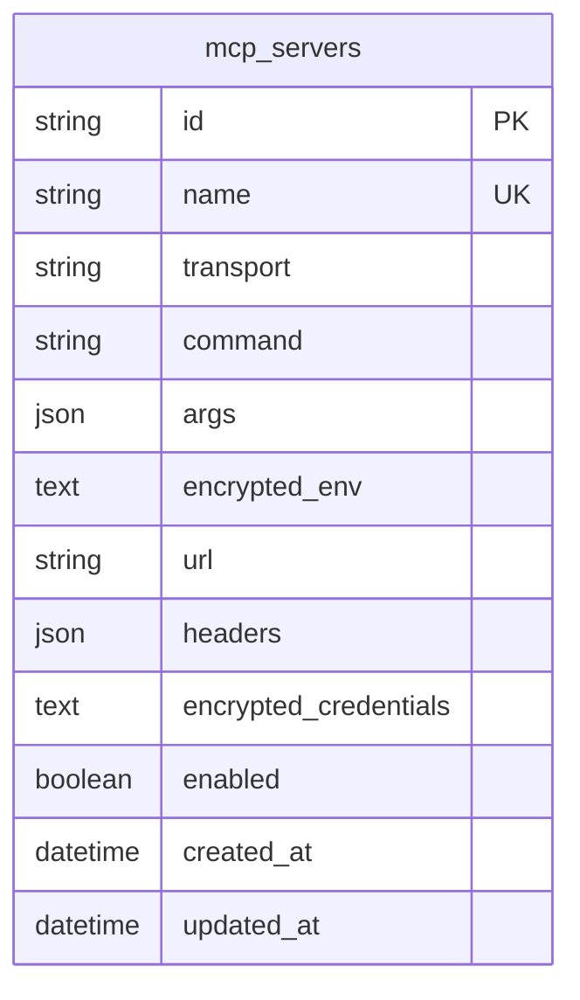

# feat: Add MCP Server Support

## Overview

Add support for connecting to external MCP (Model Context Protocol) servers, allowing agents to discover and invoke tools provided by those servers. Admin users configure MCP server connections (including credentials) via dashboard and API. Agents reference MCP servers in their AGENT.md frontmatter, and the gateway transparently proxies tool calls to the appropriate MCP server during execution.

## Problem Statement / Motivation

Agents currently can only use tools defined locally (via `@gw.tool()` decorators or `handler.py` files in the workspace). The MCP standard enables agents to access tools from any MCP-compliant server (databases, APIs, SaaS integrations, code interpreters, etc.) without writing custom tool code. This dramatically expands agent capabilities with zero custom tool development.

## Scope

**Included:**
- Database model for MCP server configurations (name, transport, URL/command, credentials)
- Admin-only REST API for CRUD on MCP server configs with audit logging
- Dashboard UI page for managing MCP servers (admin-only)
- MCP client connection manager with proper async lifetime management
- Tool discovery: list tools from connected MCP servers at startup and on-demand refresh
- Tool execution: proxy `call_tool` to the correct MCP server during agent execution
- Credential and environment variable encryption using existing `secrets.py` Fernet infrastructure
- Support for both **stdio** and **Streamable HTTP** transports
- Agent-level opt-in: agents declare which MCP servers they use in AGENT.md frontmatter
- Strict startup ordering to compute `allowed_agents` before tool registration
- Error handling, timeouts, and resilience

**Excluded (future work):**
- MCP Resources and Prompts (only Tools in this phase)
- OAuth2 authentication for MCP servers (bearer token and header auth only for now)
- SSE transport (deprecated in favor of Streamable HTTP in the MCP spec)
- Hot-reload of MCP server configs (requires gateway restart or manual refresh)
- Per-user MCP server configurations (all MCP configs are admin/global)

## Prerequisites

- Add `mcp>=1.20` to `pyproject.toml` dependencies
- Existing `AGENT_GATEWAY_SECRET_KEY` environment variable for credential encryption

## Architecture / Design

### High-Level Flow

```
Admin configures MCP server (API/Dashboard)
    |
    v
McpServerConfig stored in DB (credentials + env encrypted)
    |
    v
Gateway startup:
  1. Load workspace (parse all agents' mcp_servers lists)
  2. Load MCP configs from DB + pending list
  3. McpConnectionManager.connect_all() with background tasks
  4. list_tools() per server
  5. Compute allowed_agents from agent frontmatter
  6. Register MCP tools in ToolRegistry with allowed_agents
    |
    v
Execution engine calls tool -> runner receives McpConnectionManager
    via ToolContext.mcp_manager -> dispatches call_tool()
```

### Component Diagram

```
+------------------+     +---------------------+     +------------------+
|  Dashboard /     |---->|  MCP Server Config   |---->| Persistence      |
|  Admin API       |     |  CRUD + Audit Log    |     | (mcp_servers     |
+------------------+     +---------------------+     |  table)          |
                                                      +--------+---------+
                                                               |
                         +---------------------+               |
                         | McpConnectionManager |<--------------+
                         | (Gateway._mcp_mgr)   |
                         +----------+----------+
                                    |  asyncio.create_task + Event
                         +----------v----------+
                         |  MCP ClientSession   |  (per server, held open)
                         |  - list_tools()      |
                         |  - call_tool()       |
                         +----------+----------+
                                    |
                         +----------v----------+
                         |   ToolRegistry       |
                         |   source="mcp"       |
                         |   allowed_agents set |
                         +---------------------+
```

### Key Design Decisions

1. **MCP tools as a new `ResolvedTool.source` type**: Change `ResolvedTool.source` from `str` to `Literal["file", "code", "mcp"]`. A new `McpToolRef` dataclass on `ResolvedTool` holds the server name + original MCP tool name.

2. **Connection manager owned by Gateway**: `McpConnectionManager` is stored as `Gateway._mcp_manager`. It is passed to `ExecutionEngine.__init__` and injected into `ToolContext.mcp_manager` so the tool runner can access it without singletons or global state.

3. **Async context manager lifetime via background tasks**: MCP transport context managers (`stdio_client`, `streamablehttp_client`) and `ClientSession` context managers are held open using `asyncio.create_task` + `asyncio.Event` pairs. The background task enters both context managers and blocks on the event. Shutdown signals the event and awaits the task.

4. **Agent opt-in via frontmatter with strict startup ordering**: Agents declare `mcp_servers: [server-name]` in AGENT.md. The gateway computes `allowed_agents` for each MCP tool by scanning all agents' `mcp_servers` lists **after** workspace loads but **before** registering MCP tools. This ensures MCP tools never leak to unauthorized agents.

5. **Credential and env encryption**: Both the `credentials` dict and the `env` dict are encrypted at rest using the existing `secrets.py` Fernet infrastructure. The `env` dict for stdio servers is a secret injection vector (often contains API keys like `GITHUB_TOKEN`) and must be treated as sensitive.

6. **Tool namespacing**: MCP tools are namespaced as `{server_name}__{tool_name}`. The `__` separator is a hard-coded module constant (`MCP_TOOL_SEPARATOR = "__"`), not configurable.

## Implementation Steps

### Phase 1: Data Model and Persistence

#### Step 1.1: Domain Dataclass

Add `McpServerConfig` to `/src/agent_gateway/persistence/domain.py` alongside existing mapped dataclasses (following the same pattern as `ScheduleRecord`, `UserAgentConfig`, etc.):

```python
# /src/agent_gateway/persistence/domain.py
@dataclass
class McpServerConfig:
    """Configuration for an MCP server connection. Persisted in DB."""
    id: str                          # UUID
    name: str                        # unique, slug-like: "my-github-server"
    transport: str                   # "stdio" | "streamable_http"
    # Stdio fields
    command: str | None = None       # e.g. "python"
    args: list[str] | None = None    # e.g. ["-m", "my_mcp_server"]
    encrypted_env: str | None = None # Fernet-encrypted JSON of env dict
    # HTTP fields
    url: str | None = None           # e.g. "http://localhost:8080/mcp"
    headers: dict[str, str] | None = None  # non-sensitive headers only
    # Auth (all sensitive values encrypted)
    encrypted_credentials: str | None = None  # Fernet-encrypted JSON of credentials dict
    # Metadata
    enabled: bool = True
    created_at: datetime | None = None
    updated_at: datetime | None = None
```

**Note on encrypted fields**: Both `encrypted_env` and `encrypted_credentials` are stored as single Fernet-encrypted strings (the encrypted form of `json.dumps(the_dict)`). This is simpler and more secure than encrypting individual values -- the entire blob is opaque at rest.

Create `/src/agent_gateway/mcp/__init__.py` (empty) and `/src/agent_gateway/mcp/domain.py` for non-persisted runtime types:

```python
# /src/agent_gateway/mcp/domain.py
from __future__ import annotations

from dataclasses import dataclass
from typing import Any, Literal

MCP_TOOL_SEPARATOR: str = "__"
"""Hard-coded separator for namespacing MCP tools: {server_name}__{tool_name}."""


@dataclass
class McpToolInfo:
    """A tool discovered from an MCP server (runtime only, not persisted)."""
    server_name: str
    name: str                    # original MCP tool name
    description: str
    input_schema: dict[str, Any]

    @property
    def namespaced_name(self) -> str:
        return f"{self.server_name}{MCP_TOOL_SEPARATOR}{self.name}"


@dataclass
class McpToolRef:
    """Reference stored on ResolvedTool for MCP tool dispatch (runtime only)."""
    server_name: str
    tool_name: str  # original (un-namespaced) name
```

#### Step 1.2: Database Table

Add to `build_tables()` in `/src/agent_gateway/persistence/backends/sql/base.py`:

```python
mcp_servers = Table(
    f"{prefix}mcp_servers",
    metadata,
    Column("id", String, primary_key=True),
    Column("name", String, nullable=False),
    Column("transport", String, nullable=False),  # "stdio" | "streamable_http"
    Column("command", String, nullable=True),
    Column("args", JSON, nullable=True),
    Column("encrypted_env", Text, nullable=True),  # Fernet-encrypted JSON string
    Column("url", String, nullable=True),
    Column("headers", JSON, nullable=True),
    Column("encrypted_credentials", Text, nullable=True),  # Fernet-encrypted JSON string
    Column("enabled", Boolean, nullable=False, default=True),
    Column("created_at", DateTime(timezone=True), nullable=False, server_default=func.now()),
    Column("updated_at", DateTime(timezone=True), nullable=True),
    Index(f"ix_{prefix}mcp_servers_name", "name", unique=True),
)
```

Return it in the tables dict as `"mcp_servers": mcp_servers`. Add `configure_mappers` entry:

```python
mapper_registry.map_imperatively(McpServerConfig, tables["mcp_servers"])
```

Import `McpServerConfig` from `persistence.domain` in `base.py`.

#### Step 1.3: Migration

Create `/src/agent_gateway/persistence/migrations/versions/012_mcp_servers.py`:

```python
"""Add mcp_servers table for MCP server configurations.

Revision ID: 012
Revises: 011
Create Date: 2026-02-28
"""

from collections.abc import Sequence

import sqlalchemy as sa
from alembic import op

revision: str = "012"
down_revision: str | None = "011"
branch_labels: str | Sequence[str] | None = None
depends_on: str | Sequence[str] | None = None


def upgrade() -> None:
    op.create_table(
        "mcp_servers",
        sa.Column("id", sa.String, primary_key=True),
        sa.Column("name", sa.String, nullable=False),
        sa.Column("transport", sa.String, nullable=False),
        sa.Column("command", sa.String, nullable=True),
        sa.Column("args", sa.JSON, nullable=True),
        sa.Column("encrypted_env", sa.Text, nullable=True),
        sa.Column("url", sa.String, nullable=True),
        sa.Column("headers", sa.JSON, nullable=True),
        sa.Column("encrypted_credentials", sa.Text, nullable=True),
        sa.Column("enabled", sa.Boolean, nullable=False, server_default=sa.text("1")),
        sa.Column(
            "created_at",
            sa.DateTime(timezone=True),
            nullable=False,
            server_default=sa.func.now(),
        ),
        sa.Column("updated_at", sa.DateTime(timezone=True), nullable=True),
    )
    op.create_index("ix_mcp_servers_name", "mcp_servers", ["name"], unique=True)


def downgrade() -> None:
    op.drop_index("ix_mcp_servers_name", table_name="mcp_servers")
    op.drop_table("mcp_servers")
```

#### Step 1.4: Repository Protocol and Implementation

Add to `/src/agent_gateway/persistence/protocols.py`:

```python
@runtime_checkable
class McpServerRepository(Protocol):
    """Repository for MCP server configurations.

    Decorated with @runtime_checkable to match all other repository protocols
    in this module.
    """
    async def list_all(self) -> list[McpServerConfig]: ...
    async def get_by_name(self, name: str) -> McpServerConfig | None: ...
    async def get_by_id(self, server_id: str) -> McpServerConfig | None: ...
    async def upsert(self, config: McpServerConfig) -> McpServerConfig: ...
    async def delete(self, server_id: str) -> bool: ...
    async def list_enabled(self) -> list[McpServerConfig]: ...
```

Add SQL implementation in `/src/agent_gateway/persistence/backends/sql/repository.py` following the `ScheduleRepository` pattern.

Add `NullMcpServerRepository` in `/src/agent_gateway/persistence/null.py`:

```python
class NullMcpServerRepository:
    """No-op MCP server repository when persistence is disabled.

    Returns empty results for all queries. When persistence is disabled,
    the _pending_mcp_servers list on Gateway is the ONLY source of MCP
    server configs.
    """
    async def list_all(self) -> list[McpServerConfig]:
        return []

    async def get_by_name(self, name: str) -> McpServerConfig | None:
        return None

    async def get_by_id(self, server_id: str) -> McpServerConfig | None:
        return None

    async def upsert(self, config: McpServerConfig) -> McpServerConfig:
        return config

    async def delete(self, server_id: str) -> bool:
        return False

    async def list_enabled(self) -> list[McpServerConfig]:
        return []
```

Wire up in `SqlBackend.__init__()`:

```python
from agent_gateway.persistence.backends.sql.repository import (
    McpServerRepository as McpServerRepo,
)
self._mcp_server_repo: McpServerRepository = McpServerRepo(self._session_factory)
```

Expose via property:

```python
@property
def mcp_server_repo(self) -> McpServerRepository:
    return self._mcp_server_repo
```

### Phase 2: Connection Manager

#### Step 2.1: MCP Connection Lifetime Pattern

The core challenge is that MCP SDK transports (`stdio_client`, `streamablehttp_client`) and `ClientSession` are async context managers. They must be held open for the gateway's entire lifetime, not just for a single `async with` block.

**Pattern: `asyncio.create_task` + `asyncio.Event` to hold context managers open.**

Create `/src/agent_gateway/mcp/manager.py`:

```python
# /src/agent_gateway/mcp/manager.py
from __future__ import annotations

import asyncio
import json
import logging
from dataclasses import dataclass, field
from typing import Any

from mcp import ClientSession
from mcp.client.stdio import StdioServerParameters, stdio_client
from mcp.client.streamable_http import streamablehttp_client

from agent_gateway.exceptions import McpConnectionError
from agent_gateway.mcp.domain import McpToolInfo, McpToolRef
from agent_gateway.persistence.domain import McpServerConfig
from agent_gateway.secrets import decrypt_json_blob

logger = logging.getLogger(__name__)


@dataclass
class McpConnection:
    """A live connection to a single MCP server."""
    config: McpServerConfig
    session: ClientSession
    tools: list[McpToolInfo] = field(default_factory=list)
    # Lifecycle handles
    _shutdown_event: asyncio.Event = field(default_factory=asyncio.Event)
    _background_task: asyncio.Task[None] | None = None


class McpConnectionManager:
    """Manages MCP client connections to configured servers.

    Owned by Gateway (stored as Gateway._mcp_manager). Passed to
    ExecutionEngine and injected into ToolContext so the tool runner
    can call MCP tools without singletons.
    """

    def __init__(self, connection_timeout_ms: int = 10_000) -> None:
        self._connections: dict[str, McpConnection] = {}  # keyed by server name
        self._connection_timeout_s = connection_timeout_ms / 1000.0

    async def connect_all(self, configs: list[McpServerConfig]) -> None:
        """Connect to all enabled MCP servers. Called during gateway startup.

        Failures are logged and skipped -- never blocks startup.
        """
        for config in configs:
            if not config.enabled:
                continue
            try:
                await self._connect_one(config)
                logger.info(
                    "Connected to MCP server '%s' (%s), discovered %d tools",
                    config.name,
                    config.transport,
                    len(self._connections[config.name].tools),
                )
            except Exception:
                logger.error(
                    "Failed to connect to MCP server '%s'",
                    config.name,
                    exc_info=True,
                )

    async def _connect_one(self, config: McpServerConfig) -> None:
        """Establish connection to a single MCP server.

        Spawns a background task that enters the transport and session
        context managers and blocks on a shutdown event. The session
        is made available immediately via a ready_event.
        """
        # Decrypt credentials and env
        credentials = decrypt_json_blob(config.encrypted_credentials)
        env_vars = decrypt_json_blob(config.encrypted_env)

        shutdown_event = asyncio.Event()
        ready_event = asyncio.Event()
        session_holder: list[ClientSession] = []  # mutable container for the session
        error_holder: list[Exception] = []

        async def _run_connection() -> None:
            """Background task: enter transport CM + session CM, block until shutdown."""
            try:
                if config.transport == "stdio":
                    if config.command is None:
                        raise ValueError(
                            f"MCP server '{config.name}': stdio transport requires 'command'"
                        )
                    # Merge decrypted env vars into subprocess environment
                    merged_env = dict(env_vars) if env_vars else None
                    server_params = StdioServerParameters(
                        command=config.command,
                        args=config.args or [],
                        env=merged_env,
                    )
                    async with stdio_client(server_params) as (read, write):
                        async with ClientSession(read, write) as session:
                            await session.initialize()
                            session_holder.append(session)
                            ready_event.set()
                            # Block here until shutdown is requested
                            await shutdown_event.wait()

                elif config.transport == "streamable_http":
                    if config.url is None:
                        raise ValueError(
                            f"MCP server '{config.name}': "
                            "streamable_http transport requires 'url'"
                        )
                    # Build headers with auth
                    headers = dict(config.headers or {})
                    if credentials:
                        if "bearer_token" in credentials:
                            headers["Authorization"] = f"Bearer {credentials['bearer_token']}"
                        if "api_key" in credentials and "api_key_header" in credentials:
                            headers[credentials["api_key_header"]] = credentials["api_key"]

                    async with streamablehttp_client(
                        config.url, headers=headers
                    ) as (read, write, _get_session_id):
                        async with ClientSession(read, write) as session:
                            await session.initialize()
                            session_holder.append(session)
                            ready_event.set()
                            await shutdown_event.wait()

                else:
                    raise ValueError(
                        f"MCP server '{config.name}': "
                        f"unsupported transport '{config.transport}'"
                    )
            except Exception as exc:
                error_holder.append(exc)
                ready_event.set()  # unblock the caller even on failure

        # Spawn background task
        task = asyncio.create_task(_run_connection(), name=f"mcp-{config.name}")

        # Wait for the session to be ready, with timeout
        try:
            await asyncio.wait_for(
                ready_event.wait(), timeout=self._connection_timeout_s
            )
        except TimeoutError:
            task.cancel()
            with contextlib.suppress(asyncio.CancelledError):
                await task
            raise McpConnectionError(
                f"MCP server '{config.name}' connection timed out "
                f"after {self._connection_timeout_s}s",
                server_name=config.name,
            )

        if error_holder:
            # Task failed during setup -- cancel it and re-raise
            task.cancel()
            with contextlib.suppress(asyncio.CancelledError):
                await task
            raise error_holder[0]

        if not session_holder:
            task.cancel()
            raise RuntimeError(f"MCP server '{config.name}': session not established")

        session = session_holder[0]

        # Discover tools
        tools_result = await session.list_tools()
        discovered: list[McpToolInfo] = [
            McpToolInfo(
                server_name=config.name,
                name=t.name,
                description=t.description or "",
                input_schema=t.inputSchema if hasattr(t, "inputSchema") else {},
            )
            for t in tools_result.tools
        ]

        conn = McpConnection(
            config=config,
            session=session,
            tools=discovered,
            _shutdown_event=shutdown_event,
            _background_task=task,
        )
        self._connections[config.name] = conn

    async def disconnect_all(self) -> None:
        """Gracefully close all connections. Called during gateway shutdown."""
        for name, conn in self._connections.items():
            try:
                conn._shutdown_event.set()  # signal the background task to exit
                if conn._background_task is not None:
                    await asyncio.wait_for(conn._background_task, timeout=5.0)
            except Exception:
                logger.warning(
                    "Error disconnecting MCP server '%s'", name, exc_info=True
                )
        self._connections.clear()

    async def disconnect_one(self, name: str) -> None:
        """Disconnect a single server."""
        conn = self._connections.pop(name, None)
        if conn is None:
            return
        conn._shutdown_event.set()
        if conn._background_task is not None:
            try:
                await asyncio.wait_for(conn._background_task, timeout=5.0)
            except Exception:
                logger.warning("Error disconnecting MCP server '%s'", name, exc_info=True)

    async def refresh_server(self, name: str, config: McpServerConfig) -> None:
        """Reconnect a single server (after config change)."""
        await self.disconnect_one(name)
        await self._connect_one(config)

    def get_tools(self, server_name: str) -> list[McpToolInfo]:
        """Get discovered tools for a server. Returns empty list if not connected."""
        conn = self._connections.get(server_name)
        if conn is None:
            return []
        return list(conn.tools)

    def get_all_tools(self) -> dict[str, list[McpToolInfo]]:
        """Get all discovered tools grouped by server name."""
        return {name: list(c.tools) for name, c in self._connections.items()}

    def is_connected(self, server_name: str) -> bool:
        """Check if a server has an active connection."""
        conn = self._connections.get(server_name)
        if conn is None:
            return False
        task = conn._background_task
        return task is not None and not task.done()

    async def call_tool(
        self, server_name: str, tool_name: str, arguments: dict[str, Any]
    ) -> Any:
        """Proxy a tool call to the appropriate MCP server.

        Raises McpToolExecutionError if the server is not connected or the call fails.
        """
        from agent_gateway.exceptions import McpToolExecutionError

        conn = self._connections.get(server_name)
        if conn is None:
            raise McpToolExecutionError(
                f"MCP server '{server_name}' is not connected",
                server_name=server_name,
                tool_name=tool_name,
            )

        # Check background task is still alive
        if conn._background_task is None or conn._background_task.done():
            raise McpToolExecutionError(
                f"MCP server '{server_name}' connection has been lost",
                server_name=server_name,
                tool_name=tool_name,
            )

        result = await conn.session.call_tool(tool_name, arguments=arguments)
        return _format_mcp_result(result)


def _format_mcp_result(result: Any) -> str:
    """Format MCP CallToolResult content into a string for the LLM."""
    # MCP CallToolResult has a .content list of TextContent/ImageContent/etc.
    parts: list[str] = []
    for item in result.content:
        if hasattr(item, "text"):
            parts.append(item.text)
        elif hasattr(item, "data"):
            parts.append(f"[binary content: {item.mimeType}]")
        else:
            parts.append(str(item))
    return "\n".join(parts)
```

#### Step 2.2: `import contextlib` at top of manager.py

Ensure `import contextlib` is included in the imports (used in `_connect_one` error path).

### Phase 3: Tool Registry Integration

#### Step 3.1: Type-Narrow `ResolvedTool.source`

In `/src/agent_gateway/workspace/registry.py`, change the `source` field from `str` to a `Literal`:

```python
from typing import Literal

@dataclass
class ResolvedTool:
    """A tool ready for execution -- unified interface for file, code, and MCP tools."""

    name: str
    description: str
    source: Literal["file", "code", "mcp"]
    llm_declaration: dict[str, Any]
    parameters_schema: dict[str, Any]
    allowed_agents: list[str] | None = None
    require_approval: bool = False
    # File tool fields
    file_tool: ToolDefinition | None = None
    # Code tool fields
    code_tool: CodeTool | None = None
    # MCP tool fields
    mcp_tool: McpToolRef | None = None  # set when source="mcp"
```

Use `TYPE_CHECKING` guard for the import:

```python
from __future__ import annotations
from typing import TYPE_CHECKING

if TYPE_CHECKING:
    from agent_gateway.mcp.domain import McpToolRef
```

At runtime, `McpToolRef` is only needed for type annotation, not construction (construction happens in `register_mcp_tools` which imports it directly).

#### Step 3.2: Register MCP Tools in ToolRegistry

Add `_mcp_tools: dict[str, ResolvedTool]` to `ToolRegistry.__init__()`:

```python
def __init__(self) -> None:
    self._file_tools: dict[str, ToolDefinition] = {}
    self._code_tools: dict[str, CodeTool] = {}
    self._mcp_tools: dict[str, ResolvedTool] = {}
    self._resolved: dict[str, ResolvedTool] | None = None
```

Add registration method:

```python
def register_mcp_tools(
    self,
    tools: list[McpToolInfo],
    allowed_agents: list[str] | None = None,
) -> None:
    """Register tools discovered from MCP servers.

    Args:
        tools: Discovered MCP tools.
        allowed_agents: Agent IDs permitted to use these tools.
            If None, tools are available to all agents (not recommended).
    """
    from agent_gateway.mcp.domain import McpToolRef

    for tool in tools:
        ns_name = tool.namespaced_name
        resolved = ResolvedTool(
            name=ns_name,
            description=tool.description,
            source="mcp",
            llm_declaration={
                "type": "function",
                "function": {
                    "name": ns_name,
                    "description": tool.description,
                    "parameters": tool.input_schema,
                },
            },
            parameters_schema=tool.input_schema,
            allowed_agents=allowed_agents,
            mcp_tool=McpToolRef(
                server_name=tool.server_name,
                tool_name=tool.name,
            ),
        )
        self._mcp_tools[ns_name] = resolved
    self._resolved = None  # invalidate cache
```

Add `clear_mcp_tools` method for refresh:

```python
def clear_mcp_tools(self) -> None:
    """Remove all MCP tools (called before re-registering after refresh)."""
    self._mcp_tools.clear()
    self._resolved = None
```

Update `_resolve_all()` to merge MCP tools with lowest priority:

```python
def _resolve_all(self) -> dict[str, ResolvedTool]:
    if self._resolved is not None:
        return self._resolved

    resolved: dict[str, ResolvedTool] = {}

    # MCP tools first (lowest priority -- overridden by file and code tools)
    for mt in self._mcp_tools.values():
        resolved[mt.name] = mt

    # File tools override MCP tools
    for ft in self._file_tools.values():
        perms = ft.permissions
        resolved[ft.name] = ResolvedTool(
            name=ft.name,
            description=ft.description,
            source="file",
            llm_declaration=ft.to_llm_declaration(),
            parameters_schema=ft.to_json_schema(),
            allowed_agents=perms.get("allowed_agents"),
            require_approval=perms.get("require_approval", False),
            file_tool=ft,
        )

    # Code tools override both file and MCP tools
    for ct in self._code_tools.values():
        resolved[ct.name] = ResolvedTool(
            name=ct.name,
            description=ct.description,
            source="code",
            llm_declaration=ct.to_llm_declaration(),
            parameters_schema=ct.parameters_schema,
            allowed_agents=ct.allowed_agents,
            require_approval=ct.require_approval,
            code_tool=ct,
        )

    self._resolved = resolved
    return resolved
```

### Phase 4: Tool Execution

#### Step 4.1: Add `mcp_manager` to ToolContext

In `/src/agent_gateway/engine/models.py`, add the manager reference to `ToolContext`:

```python
from __future__ import annotations
from typing import TYPE_CHECKING

if TYPE_CHECKING:
    from agent_gateway.mcp.manager import McpConnectionManager

@dataclass
class ToolContext:
    """Context passed to tool handlers during execution."""

    execution_id: str
    agent_id: str
    caller_identity: str | None = None
    metadata: dict[str, Any] = field(default_factory=dict)
    user_secrets: dict[str, str] = field(default_factory=dict)
    user_config: dict[str, Any] = field(default_factory=dict)
    # Delegation context
    parent_execution_id: str | None = None
    root_execution_id: str | None = None
    delegation_depth: int = 0
    delegates_to: list[str] = field(default_factory=list)
    # MCP
    mcp_manager: McpConnectionManager | None = None
```

In `/src/agent_gateway/engine/executor.py`, populate `mcp_manager` on the `ToolContext`:

```python
# In ExecutionEngine.__init__, add mcp_manager parameter:
def __init__(
    self,
    llm_client: LLMClient,
    tool_registry: ToolRegistry,
    config: GatewayConfig,
    hooks: HookRegistry | None = None,
    retriever_registry: RetrieverRegistry | None = None,
    execution_repo: ExecutionRepository | None = None,
    mcp_manager: McpConnectionManager | None = None,  # NEW
) -> None:
    ...
    self._mcp_manager = mcp_manager

# In execute(), when building ToolContext:
tool_context = ToolContext(
    ...
    mcp_manager=self._mcp_manager,
)
```

#### Step 4.2: Extend Tool Runner

In `/src/agent_gateway/tools/runner.py`, add MCP dispatch. The runner receives the manager via the `ToolContext`:

```python
async def execute_tool(
    tool: ResolvedTool,
    arguments: dict[str, Any],
    context: ToolContext,
) -> Any:
    """Execute a tool call, dispatching to the correct executor.

    Code tools (@gw.tool) are called directly.
    MCP tools are proxied to remote MCP servers via McpConnectionManager.
    File tools (handler.py) are dynamically imported and called.
    """
    if tool.source == "code" and tool.code_tool is not None:
        return await execute_code_tool(tool.code_tool, arguments, context)

    if tool.source == "mcp" and tool.mcp_tool is not None:
        return await execute_mcp_tool(tool.mcp_tool, arguments, context)

    if tool.file_tool is not None:
        return await execute_function_tool(tool.file_tool, arguments, context)

    raise RuntimeError(f"Tool '{tool.name}' has no executor")
```

Add `execute_mcp_tool` in the same file (or in `/src/agent_gateway/tools/mcp_executor.py` and import it):

```python
async def execute_mcp_tool(
    ref: McpToolRef,
    arguments: dict[str, Any],
    context: ToolContext,
) -> Any:
    """Execute a tool on a remote MCP server via the connection manager."""
    from agent_gateway.exceptions import McpToolExecutionError
    from agent_gateway.mcp.domain import McpToolRef  # for type only

    if context.mcp_manager is None:
        raise McpToolExecutionError(
            "MCP connection manager not available",
            server_name=ref.server_name,
            tool_name=ref.tool_name,
        )
    return await context.mcp_manager.call_tool(
        ref.server_name, ref.tool_name, arguments
    )
```

### Phase 5: Agent Frontmatter Integration

#### Step 5.1: Extend AgentDefinition

In `/src/agent_gateway/workspace/agent.py`, add `mcp_servers: list[str]` to `AgentDefinition`:

```python
@dataclass
class AgentDefinition:
    ...
    mcp_servers: list[str] = field(default_factory=list)
```

Parse from AGENT.md frontmatter (the existing frontmatter parser extracts all keys):

```yaml
---
name: my-agent
model: gemini/gemini-2.5-flash
mcp_servers:
  - github-server
  - filesystem-server
skills:
  - research
---
```

#### Step 5.2: `allowed_agents` Computation

This is handled in Phase 8 (startup ordering). The execution engine does NOT need modification because `allowed_agents` is set on `ResolvedTool` entries at registration time, and `resolve_for_agent` already filters by it.

### Phase 6: Admin API Endpoints

#### Step 6.1: Request/Response Models

Create `/src/agent_gateway/api/routes/mcp_servers.py`:

```python
from __future__ import annotations

import json
import logging
import uuid
from datetime import datetime, timezone
from typing import Any, Literal

from fastapi import APIRouter, Depends, Path, Request
from fastapi.responses import JSONResponse
from pydantic import BaseModel, Field, model_validator

from agent_gateway.api.errors import error_response, not_found
from agent_gateway.api.routes.base import GatewayAPIRoute
from agent_gateway.auth.scopes import RequireScope

logger = logging.getLogger(__name__)

router = APIRouter(route_class=GatewayAPIRoute)


class CreateMcpServerRequest(BaseModel):
    name: str = Field(..., pattern=r"^[a-z0-9][a-z0-9_-]*$", max_length=64)
    transport: Literal["stdio", "streamable_http"]
    command: str | None = None
    args: list[str] | None = None
    env: dict[str, str] | None = None          # plaintext, encrypted before storage
    url: str | None = None
    headers: dict[str, str] | None = None
    credentials: dict[str, str] | None = None   # plaintext, encrypted before storage
    enabled: bool = True

    @model_validator(mode="after")
    def _validate_transport_fields(self) -> CreateMcpServerRequest:
        if self.transport == "stdio" and not self.command:
            raise ValueError("'command' is required for stdio transport")
        if self.transport == "streamable_http" and not self.url:
            raise ValueError("'url' is required for streamable_http transport")
        if self.transport == "stdio" and self.url:
            raise ValueError("'url' should not be set for stdio transport")
        if self.transport == "streamable_http" and self.command:
            raise ValueError("'command' should not be set for streamable_http transport")
        return self


class UpdateMcpServerRequest(BaseModel):
    """Update an MCP server config. All fields are optional.

    Semantics:
    - Present field with a value: replaces the existing value.
    - Absent field (not in JSON body): left unchanged.
    - credentials/env: if provided, fully replaces the encrypted blob.
      To add a single credential, the client must re-send all credentials.
      To clear credentials, send an empty dict {}.
    """
    name: str | None = Field(None, pattern=r"^[a-z0-9][a-z0-9_-]*$", max_length=64)
    transport: Literal["stdio", "streamable_http"] | None = None
    command: str | None = None
    args: list[str] | None = None
    env: dict[str, str] | None = None
    url: str | None = None
    headers: dict[str, str] | None = None
    credentials: dict[str, str] | None = None
    enabled: bool | None = None

    @model_validator(mode="after")
    def _validate_transport_fields(self) -> UpdateMcpServerRequest:
        # Only validate cross-field if transport is being changed
        if self.transport == "stdio" and self.url is not None:
            raise ValueError("'url' should not be set for stdio transport")
        if self.transport == "streamable_http" and self.command is not None:
            raise ValueError("'command' should not be set for streamable_http transport")
        return self


class McpServerResponse(BaseModel):
    id: str
    name: str
    transport: str
    command: str | None = None
    args: list[str] | None = None
    url: str | None = None
    headers: dict[str, str] | None = None
    enabled: bool
    credential_keys: list[str]   # names only, never values
    has_env: bool                 # whether encrypted env is set
    tool_count: int
    connected: bool
    created_at: str
    updated_at: str | None = None


class McpToolResponse(BaseModel):
    name: str              # namespaced: "server__tool"
    original_name: str     # MCP-native name
    server_name: str
    description: str
    input_schema: dict[str, Any]
```

#### Step 6.2: CRUD Endpoints with Audit Logging

```python
@router.post(
    "/admin/mcp-servers",
    response_model=McpServerResponse,
    summary="Create MCP server config",
    tags=["Admin"],
    dependencies=[Depends(RequireScope("admin:*"))],
)
async def create_mcp_server(
    request: Request, body: CreateMcpServerRequest
) -> McpServerResponse:
    gw = request.app
    from agent_gateway.secrets import encrypt_value

    # Encrypt credentials and env
    encrypted_creds = (
        encrypt_value(json.dumps(body.credentials)) if body.credentials else None
    )
    encrypted_env = (
        encrypt_value(json.dumps(body.env)) if body.env else None
    )

    config = McpServerConfig(
        id=str(uuid.uuid4()),
        name=body.name,
        transport=body.transport,
        command=body.command,
        args=body.args,
        encrypted_env=encrypted_env,
        url=body.url,
        headers=body.headers,
        encrypted_credentials=encrypted_creds,
        enabled=body.enabled,
        created_at=datetime.now(timezone.utc),
    )

    await gw._mcp_repo.upsert(config)

    # Audit log
    await gw._audit_repo.log(
        event_type="mcp_server.created",
        actor=_get_actor(request),
        resource_type="mcp_server",
        resource_id=config.id,
        metadata={"name": config.name, "transport": config.transport},
    )

    return _to_response(config, gw._mcp_manager)


@router.get(
    "/admin/mcp-servers",
    response_model=list[McpServerResponse],
    summary="List MCP server configs",
    tags=["Admin"],
    dependencies=[Depends(RequireScope("admin:*"))],
)
async def list_mcp_servers(request: Request) -> list[McpServerResponse]:
    gw = request.app
    configs = await gw._mcp_repo.list_all()
    return [_to_response(c, gw._mcp_manager) for c in configs]


@router.get(
    "/admin/mcp-servers/{server_id}",
    response_model=McpServerResponse,
    summary="Get MCP server config",
    tags=["Admin"],
    dependencies=[Depends(RequireScope("admin:*"))],
)
async def get_mcp_server(
    request: Request, server_id: str = Path(...)
) -> McpServerResponse:
    gw = request.app
    config = await gw._mcp_repo.get_by_id(server_id)
    if config is None:
        return not_found("MCP server not found")
    return _to_response(config, gw._mcp_manager)


@router.put(
    "/admin/mcp-servers/{server_id}",
    response_model=McpServerResponse,
    summary="Update MCP server config",
    tags=["Admin"],
    dependencies=[Depends(RequireScope("admin:*"))],
)
async def update_mcp_server(
    request: Request,
    body: UpdateMcpServerRequest,
    server_id: str = Path(...),
) -> McpServerResponse:
    gw = request.app
    from agent_gateway.secrets import encrypt_value

    existing = await gw._mcp_repo.get_by_id(server_id)
    if existing is None:
        return not_found("MCP server not found")

    # Apply updates (only fields present in the request body)
    update_data = body.model_dump(exclude_unset=True)

    if "name" in update_data:
        existing.name = update_data["name"]
    if "transport" in update_data:
        existing.transport = update_data["transport"]
    if "command" in update_data:
        existing.command = update_data["command"]
    if "args" in update_data:
        existing.args = update_data["args"]
    if "url" in update_data:
        existing.url = update_data["url"]
    if "headers" in update_data:
        existing.headers = update_data["headers"]
    if "enabled" in update_data:
        existing.enabled = update_data["enabled"]
    if "credentials" in update_data:
        existing.encrypted_credentials = (
            encrypt_value(json.dumps(update_data["credentials"]))
            if update_data["credentials"]
            else None
        )
    if "env" in update_data:
        existing.encrypted_env = (
            encrypt_value(json.dumps(update_data["env"]))
            if update_data["env"]
            else None
        )
    existing.updated_at = datetime.now(timezone.utc)

    await gw._mcp_repo.upsert(existing)

    # Audit log
    await gw._audit_repo.log(
        event_type="mcp_server.updated",
        actor=_get_actor(request),
        resource_type="mcp_server",
        resource_id=existing.id,
        metadata={"name": existing.name, "fields_updated": list(update_data.keys())},
    )

    return _to_response(existing, gw._mcp_manager)


@router.delete(
    "/admin/mcp-servers/{server_id}",
    summary="Delete MCP server config",
    tags=["Admin"],
    dependencies=[Depends(RequireScope("admin:*"))],
)
async def delete_mcp_server(
    request: Request, server_id: str = Path(...)
) -> JSONResponse:
    gw = request.app
    existing = await gw._mcp_repo.get_by_id(server_id)
    if existing is None:
        return not_found("MCP server not found")

    # Disconnect if connected
    if gw._mcp_manager is not None:
        await gw._mcp_manager.disconnect_one(existing.name)

    deleted = await gw._mcp_repo.delete(server_id)

    # Audit log
    await gw._audit_repo.log(
        event_type="mcp_server.deleted",
        actor=_get_actor(request),
        resource_type="mcp_server",
        resource_id=server_id,
        metadata={"name": existing.name},
    )

    return JSONResponse({"deleted": deleted})


@router.post(
    "/admin/mcp-servers/{server_id}/refresh",
    response_model=McpServerResponse,
    summary="Reconnect and rediscover tools",
    tags=["Admin"],
    dependencies=[Depends(RequireScope("admin:*"))],
)
async def refresh_mcp_server(
    request: Request, server_id: str = Path(...)
) -> McpServerResponse:
    gw = request.app
    config = await gw._mcp_repo.get_by_id(server_id)
    if config is None:
        return not_found("MCP server not found")

    await gw._mcp_manager.refresh_server(config.name, config)

    # Re-register tools (need to rebuild allowed_agents)
    _reregister_mcp_tools(gw)

    return _to_response(config, gw._mcp_manager)


@router.get(
    "/admin/mcp-servers/{server_id}/tools",
    response_model=list[McpToolResponse],
    summary="List discovered tools for an MCP server",
    tags=["Admin"],
    dependencies=[Depends(RequireScope("admin:*"))],
)
async def list_mcp_server_tools(
    request: Request, server_id: str = Path(...)
) -> list[McpToolResponse]:
    gw = request.app
    config = await gw._mcp_repo.get_by_id(server_id)
    if config is None:
        return not_found("MCP server not found")

    tools = gw._mcp_manager.get_tools(config.name)
    return [
        McpToolResponse(
            name=t.namespaced_name,
            original_name=t.name,
            server_name=t.server_name,
            description=t.description,
            input_schema=t.input_schema,
        )
        for t in tools
    ]


# --- Helpers ---

def _get_actor(request: Request) -> str:
    """Extract actor identity from request for audit logging."""
    identity = getattr(request.state, "identity", None)
    return str(identity) if identity else "unknown"


def _to_response(
    config: McpServerConfig, manager: McpConnectionManager
) -> McpServerResponse:
    """Convert domain object to API response (never exposing secrets)."""
    from agent_gateway.secrets import decrypt_json_blob

    # Determine credential key names without exposing values
    cred_keys: list[str] = []
    if config.encrypted_credentials:
        try:
            creds = decrypt_json_blob(config.encrypted_credentials)
            cred_keys = list(creds.keys())
        except Exception:
            cred_keys = ["<decryption_failed>"]

    return McpServerResponse(
        id=config.id,
        name=config.name,
        transport=config.transport,
        command=config.command,
        args=config.args,
        url=config.url,
        headers=config.headers,
        enabled=config.enabled,
        credential_keys=cred_keys,
        has_env=bool(config.encrypted_env),
        tool_count=len(manager.get_tools(config.name)),
        connected=manager.is_connected(config.name),
        created_at=config.created_at.isoformat() if config.created_at else "",
        updated_at=config.updated_at.isoformat() if config.updated_at else None,
    )


def _reregister_mcp_tools(gw: Any) -> None:
    """Recompute allowed_agents and re-register all MCP tools.

    Called after refresh or reconnect. Uses the same logic as Phase 8.1.
    Accesses workspace and tool_registry via gw._snapshot (the runtime
    snapshot built during startup). _snapshot is None before startup
    completes, so callers must guard.
    """
    if gw._snapshot is None:
        logger.warning("Cannot re-register MCP tools: gateway snapshot not initialized")
        return

    gw._snapshot.tool_registry.clear_mcp_tools()

    all_mcp_tools = gw._mcp_manager.get_all_tools()
    server_to_agents = _compute_server_to_agents(gw._snapshot.workspace)

    for server_name, tools in all_mcp_tools.items():
        allowed = server_to_agents.get(server_name)
        gw._snapshot.tool_registry.register_mcp_tools(tools, allowed_agents=allowed)
```

#### Step 6.3: Mount Routes

In `/src/agent_gateway/gateway.py`, mount the router inside the existing route registration logic:

```python
from agent_gateway.api.routes.mcp_servers import router as mcp_servers_router
self._v1_router.include_router(mcp_servers_router)
```

### Phase 7: Dashboard UI (Admin-Only)

#### Step 7.1: Dashboard Page

Create a new dashboard page at `/dashboard/mcp-servers` (admin-only). Follow the existing pattern in `/src/agent_gateway/dashboard/router.py` and templates.

The page should:
- List configured MCP servers with status (connected/disconnected), tool count
- Allow creating new server configs (form with transport type toggle)
- Allow editing/deleting configs
- Show discovered tools per server (expandable)
- Allow manual refresh (re-connect and re-discover)
- Use `require_admin` dependency (from `make_require_admin`)

This is a standard HTMX dashboard page following existing patterns. The dashboard route should be guarded by `require_admin`.

### Phase 8: Gateway Lifecycle Integration

#### Step 8.1: Startup -- Strict Ordering

In `/src/agent_gateway/gateway.py`, during the lifespan startup, the following **strict ordering** must be followed:

```python
# --- STEP 1: Load workspace (parse all agents) ---
# This already happens: self._workspace = load_workspace(...)
# After this, all agents' mcp_servers lists are available.

# --- STEP 2: Load MCP server configs from DB + pending list ---
db_configs = await self._mcp_repo.list_enabled()

# Encrypt pending configs (raw dicts from add_mcp_server) now that
# AGENT_GATEWAY_SECRET_KEY is guaranteed to be available at startup.
from agent_gateway.secrets import encrypt_value
pending_configs: list[McpServerConfig] = []
for raw in self._pending_mcp_servers:
    pending_configs.append(McpServerConfig(
        id=str(uuid.uuid4()),
        name=raw["name"],
        transport=raw["transport"],
        command=raw.get("command"),
        args=raw.get("args"),
        encrypted_env=(
            encrypt_value(json.dumps(raw["env"])) if raw.get("env") else None
        ),
        url=raw.get("url"),
        headers=raw.get("headers"),
        encrypted_credentials=(
            encrypt_value(json.dumps(raw["credentials"]))
            if raw.get("credentials") else None
        ),
        enabled=raw.get("enabled", True),
    ))

# Merge: pending takes precedence over DB if names collide
configs_by_name: dict[str, McpServerConfig] = {}
for c in db_configs:
    configs_by_name[c.name] = c
for c in pending_configs:
    configs_by_name[c.name] = c  # overrides DB config with same name

all_configs = list(configs_by_name.values())

# --- STEP 3: Validate agent references ---
known_server_names = {c.name for c in all_configs}
for agent in self._workspace.agents.values():
    for server_name in agent.mcp_servers:
        if server_name not in known_server_names:
            logger.warning(
                "Agent '%s' references MCP server '%s' which does not exist. "
                "Tools from this server will not be available.",
                agent.id,
                server_name,
            )

# --- STEP 4: Connect to MCP servers ---
self._mcp_manager = McpConnectionManager(
    connection_timeout_ms=self._config.mcp.connection_timeout_ms,
)
await self._mcp_manager.connect_all(all_configs)

# --- STEP 5: Compute allowed_agents per server ---
server_to_agents = _compute_server_to_agents(self._workspace)

# --- STEP 6: Register MCP tools in ToolRegistry with allowed_agents ---
all_mcp_tools = self._mcp_manager.get_all_tools()
for server_name, tools in all_mcp_tools.items():
    allowed = server_to_agents.get(server_name)
    self._tool_registry.register_mcp_tools(tools, allowed_agents=allowed)

logger.info(
    "MCP setup complete: %d servers connected, %d total tools registered",
    len(self._mcp_manager._connections),
    sum(len(t) for t in all_mcp_tools.values()),
)
```

The helper function (place in `/src/agent_gateway/mcp/manager.py` or a shared util):

```python
def _compute_server_to_agents(workspace: WorkspaceState) -> dict[str, list[str]]:
    """Scan all agents' mcp_servers lists and build a reverse mapping.

    Returns: {server_name: [agent_id, ...]}
    """
    result: dict[str, list[str]] = {}
    for agent in workspace.agents.values():
        for server_name in agent.mcp_servers:
            result.setdefault(server_name, []).append(agent.id)
    return result
```

**Why this ordering matters:**
- Step 1 must complete before Step 5 because we need agent frontmatter to compute `allowed_agents`.
- Step 4 must complete before Step 6 because we need discovered tools.
- Step 3 validates agent references early so admins see warnings at startup.
- Step 6 uses `allowed_agents` so MCP tools are never exposed to agents that did not opt in.

#### Step 8.2: Pass McpConnectionManager to ExecutionEngine

In the gateway's engine construction (wherever `ExecutionEngine` is instantiated):

```python
self._engine = ExecutionEngine(
    llm_client=self._llm_client,
    tool_registry=self._tool_registry,
    config=self._config,
    hooks=self._hooks,
    retriever_registry=self._retriever_registry,
    execution_repo=self._execution_repo,
    mcp_manager=self._mcp_manager,  # NEW
)
```

#### Step 8.3: Shutdown

In the lifespan shutdown:

```python
if self._mcp_manager is not None:
    await self._mcp_manager.disconnect_all()
```

#### Step 8.4: Pending Registration Pattern

Add to `Gateway.__init__` (null defaults so the gateway is valid before startup):

```python
self._pending_mcp_servers: list[dict[str, Any]] = []  # raw dicts, encrypted at startup
self._mcp_repo: McpServerRepository = NullMcpServerRepository()
self._mcp_manager: McpConnectionManager | None = None
```

During startup (after persistence backend is initialized), replace `_mcp_repo` with the real repo:

```python
self._mcp_repo = self._backend.mcp_server_repo
```

Fluent API:

```python
def add_mcp_server(
    self,
    name: str,
    transport: str,
    *,
    command: str | None = None,
    args: list[str] | None = None,
    env: dict[str, str] | None = None,
    url: str | None = None,
    headers: dict[str, str] | None = None,
    credentials: dict[str, str] | None = None,
    enabled: bool = True,
) -> Gateway:
    """Register an MCP server programmatically (fluent API).

    Stores raw (unencrypted) values in the pending list. Encryption
    happens during startup (_apply_pending_mcp_servers) so that
    AGENT_GATEWAY_SECRET_KEY does not need to be set at import time.
    """
    self._pending_mcp_servers.append({
        "name": name,
        "transport": transport,
        "command": command,
        "args": args,
        "env": env,
        "url": url,
        "headers": headers,
        "credentials": credentials,
        "enabled": enabled,
    })
    return self
```

When persistence is disabled (`NullMcpServerRepository`), `list_enabled()` returns `[]`, so the pending list is the **only** source of MCP server configs.

## Credential Storage Strategy

MCP server credentials **and environment variables** are encrypted using the existing `secrets.py` Fernet-based encryption.

### Encryption Approach

Both `credentials` and `env` are encrypted as **whole JSON blobs** (not individual values):

1. **At rest**: `encrypted_credentials` and `encrypted_env` are `Text` columns containing a single Fernet-encrypted string. The plaintext is `json.dumps({"key": "value", ...})`.
2. **Encryption key**: `AGENT_GATEWAY_SECRET_KEY` environment variable (same as user secrets).
3. **API layer**: Admin API accepts plaintext `credentials` and `env` dicts, encrypts the entire dict as one blob before storage. Responses never return secret values -- only credential key names and a boolean `has_env`.
4. **Runtime**: `decrypt_json_blob()` from `secrets.py` decrypts when establishing connections.

### Why `env` is Encrypted

The `env` dict for stdio transports is a **secret injection vector**. It commonly contains API keys and tokens (e.g., `GITHUB_TOKEN`, `OPENAI_API_KEY`). Encrypting the entire blob ensures these values are never stored in plaintext.

### New Helper in `/src/agent_gateway/secrets.py`

Add a public `decrypt_json_blob` function (used by both `McpConnectionManager` and the API response builder):

```python
def decrypt_json_blob(encrypted: str | None, key: str | None = None) -> dict[str, str]:
    """Decrypt a Fernet-encrypted JSON blob, returning empty dict on None/empty.

    Used for MCP server credentials and env vars.
    """
    if not encrypted:
        return {}
    plaintext = decrypt_value(encrypted, key)
    result: dict[str, str] = json.loads(plaintext)
    return result
```

Also add `import json` to `secrets.py` imports.

### Supported Credential Types

- `bearer_token`: Added as `Authorization: Bearer <token>` header for HTTP transport.
- `api_key` + `api_key_header`: Added as the specified header for HTTP transport.
- All env vars in the `env` dict are injected into the subprocess environment for stdio transport.

### Update Semantics

When updating credentials or env via the API:
- Providing a `credentials` or `env` dict **fully replaces** the encrypted blob.
- Providing `null` or omitting the field leaves the existing value unchanged.
- Providing an empty dict `{}` clears the encrypted blob.

## Error Handling and Resilience

### New Exceptions

Add to `/src/agent_gateway/exceptions.py`:

```python
class McpError(AgentGatewayError):
    """Base for MCP-related errors."""


class McpConnectionError(McpError):
    """Failed to connect to an MCP server."""

    def __init__(self, message: str, server_name: str) -> None:
        self.server_name = server_name
        super().__init__(message)


class McpToolExecutionError(McpError):
    """Failed to execute a tool on an MCP server."""

    def __init__(self, message: str, server_name: str, tool_name: str) -> None:
        self.server_name = server_name
        self.tool_name = tool_name
        super().__init__(message)
```

### Resilience Patterns

- **Startup tolerance**: If an MCP server fails to connect at startup, log a warning and continue. The server's tools are simply not available. Do not block gateway startup.
- **Tool call timeout**: MCP tool calls inherit the execution engine's per-tool timeout. If the MCP server is unresponsive, the tool call fails with a timeout error (same as any other tool).
- **Connection health**: The manager checks `_background_task.done()` before each `call_tool`. If the task has exited (server crashed), the call fails immediately with `McpToolExecutionError`.
- **Graceful degradation**: If an agent references an MCP server that is not connected, its tools are simply absent from the tool list. The agent operates with reduced capability rather than failing entirely.
- **Agent reference validation**: At startup, warn if an agent's AGENT.md references an MCP server name that does not exist in the config.

## Configuration Options

### gateway.yaml (optional, most config via API/DB)

```yaml
mcp:
  tool_call_timeout_ms: 30000    # per-tool-call timeout for MCP tools
  connection_timeout_ms: 10000   # timeout for initial connection
```

Add `McpConfig` to `/src/agent_gateway/config.py`:

```python
class McpConfig(BaseModel):
    tool_call_timeout_ms: int = 30_000
    connection_timeout_ms: int = 10_000
```

Add `mcp: McpConfig = McpConfig()` to `GatewayConfig`.

The tool name separator is a hard-coded constant `MCP_TOOL_SEPARATOR = "__"` in `/src/agent_gateway/mcp/domain.py`, not configurable.

## Testing Strategy

### Unit Tests

**`/tests/test_mcp/test_domain.py`**: Test `McpToolInfo` namespacing, `McpToolRef`, `MCP_TOOL_SEPARATOR` constant.

**`/tests/test_mcp/test_manager.py`**: Test `McpConnectionManager` with mocked MCP `ClientSession`. Verify:
- `connect_all` handles connection failures gracefully (one fails, others succeed)
- `get_tools` returns discovered tools
- `call_tool` proxies correctly and raises `McpToolExecutionError` for disconnected servers
- `disconnect_all` closes all connections (sets events, awaits tasks)
- **Background task is still running** after `connect_all` returns (assert `conn._background_task.done() is False`)
- `is_connected` returns correct status
- `decrypt_json_blob` (in `secrets.py`) handles None, empty string, valid ciphertext

**`/tests/test_mcp/test_executor.py`**: Test `execute_mcp_tool` with mocked manager on `ToolContext`. Test that `mcp_manager=None` raises `McpToolExecutionError`.

**`/tests/test_tools/test_runner.py`**: Extend existing tests to cover MCP dispatch branch in `execute_tool`.

**`/tests/test_workspace/test_registry.py`**: Test:
- `register_mcp_tools` with `allowed_agents`
- `_resolve_all` priority ordering (MCP < file < code)
- `clear_mcp_tools`
- `ResolvedTool.source` is `Literal["file", "code", "mcp"]`

**`/tests/test_api/test_mcp_servers.py`**: Test request model validation:
- `CreateMcpServerRequest` cross-field validation (stdio needs command, etc.)
- `UpdateMcpServerRequest` partial update semantics

### Integration Tests

**`/tests/test_integration/test_mcp_api.py`**: Test admin CRUD endpoints with a real DB. Verify:
- Create, list, get, update, delete MCP server configs
- Credential encryption (values not returned in responses, only key names)
- `env` encryption (only `has_env` boolean in response)
- Non-admin users get 403
- Audit log entries created for create/update/delete
- Update with partial fields preserves unchanged values

**`/tests/test_integration/test_mcp_execution.py`**: Test end-to-end execution with a **FastMCP** in-process test server. Create a minimal FastMCP server in the test fixture:

```python
from mcp.server.fastmcp import FastMCP

test_mcp = FastMCP("test-server")

@test_mcp.tool()
def add(a: int, b: int) -> int:
    """Add two numbers."""
    return a + b
```

Verify:
- Agent discovers and calls MCP tools
- Tool results flow back to LLM correctly
- Namespacing works correctly (`testserver__add`)
- `allowed_agents` prevents unauthorized agent access

### Test Markers

- All MCP tests: standard (no special marker unless e2e)
- Tests requiring real external MCP servers: `@pytest.mark.e2e`

## Example Project Updates

### `/examples/test-project/workspace/mcp_test_server.py` (NEW)

Create a minimal Python-based MCP server for the example project (no external dependencies like `npx`):

```python
"""Minimal MCP server for testing -- provides a few demo tools."""
from mcp.server.fastmcp import FastMCP

mcp = FastMCP("demo-tools")


@mcp.tool()
def word_count(text: str) -> int:
    """Count the number of words in a text string."""
    return len(text.split())


@mcp.tool()
def reverse_text(text: str) -> str:
    """Reverse a text string."""
    return text[::-1]


if __name__ == "__main__":
    mcp.run()
```

### `/examples/test-project/app.py`

Add MCP server configuration using the in-repo test server:

```python
# --- MCP Servers (programmatic) ---
gw.add_mcp_server(
    name="demo-tools",
    transport="stdio",
    command="python",
    args=["workspace/mcp_test_server.py"],
)
```

### `/examples/test-project/workspace/agents/research-agent/AGENT.md`

Add `mcp_servers` to an agent:

```yaml
---
name: research-agent
model: gemini/gemini-2.5-flash
mcp_servers:
  - demo-tools
skills:
  - research
---
```

## Documentation Updates

### New Guide

Create `/docs/guides/mcp-servers.md`:
- What is MCP
- Configuring MCP servers (API, dashboard, programmatic)
- Supported transports (stdio, streamable HTTP)
- Credential and env management (encryption at rest)
- Agent integration (frontmatter)
- Tool namespacing (`server__tool`)
- Startup ordering and validation
- Troubleshooting (connection failures, tool not found, etc.)

### Update Existing Docs

- `/docs/guides/tools.md` -- mention MCP as a third tool source alongside file and code tools
- `/docs/guides/configuration.md` -- document `mcp` config section
- `/docs/api-reference/gateway.md` -- document `add_mcp_server()` method
- `/docs/api-reference/configuration.md` -- document `McpConfig`
- `/docs/llms.txt` -- add MCP section

## ERD



## Risks and Mitigations

| Risk | Impact | Mitigation |
|------|--------|------------|
| MCP server connection failures block gateway startup | High | Catch all exceptions per-server, log warnings, continue startup |
| Stdio MCP servers are long-lived subprocesses that may crash | Medium | Check `_background_task.done()` before each call; return error to LLM |
| Transport context managers close prematurely | High | `asyncio.create_task` + `asyncio.Event` pattern holds CMs open; tests verify task is alive |
| Tool name collisions between MCP servers or with local tools | Medium | Namespacing with hard-coded `__` separator; code > file > MCP priority |
| MCP SDK version incompatibilities | Low | Pin `mcp>=1.20` minimum version |
| Large number of MCP tools overwhelming LLM context | Medium | Agent-level opt-in via `allowed_agents`; future: tool filtering |
| Credential or env var leakage in logs or error messages | High | Never log decrypted credentials; encrypt env blob; sanitize error messages |
| env dict used as secret injection vector for stdio subprocesses | High | Encrypt entire env dict as Fernet blob, not just credentials |
| MCP tools leak to agents that did not opt in | High | Strict startup ordering; `allowed_agents` computed from agent frontmatter before registration |
| Agent references nonexistent MCP server | Medium | Validation warning at startup; agent operates with reduced tools |
| Singleton/global state for connection manager | Medium | Eliminated: manager on Gateway, passed to ExecutionEngine, injected via ToolContext |
| MCP server hangs during initial connection | Medium | `connection_timeout_ms` applied via `asyncio.wait_for` on ready_event; raises `McpConnectionError` |

## Verification Checklist

```bash
uv run ruff format src/ tests/
uv run ruff check src/ tests/
uv run mypy src/
uv run pytest -m "not e2e" -x -q
```

- [ ] All new files pass mypy strict mode
- [ ] `ResolvedTool.source` is `Literal["file", "code", "mcp"]`
- [ ] `McpServerConfig` is in `persistence/domain.py` (imperatively mapped)
- [ ] MCP tools have `allowed_agents` set from agent frontmatter scan
- [ ] MCP tools never appear for agents that did not declare the server
- [ ] Background tasks are alive after `connect_all` (tested)
- [ ] No singleton/global state -- manager flows through Gateway -> Engine -> ToolContext
- [ ] `Gateway.__init__` sets `_mcp_repo = NullMcpServerRepository()` and `_mcp_manager = None`
- [ ] `McpServerRepository` Protocol has `@runtime_checkable`
- [ ] `add_mcp_server()` stores raw dicts, encryption happens at startup
- [ ] `delete_mcp_server` guards `_mcp_manager is not None`
- [ ] `_reregister_mcp_tools` uses `gw._snapshot.workspace` / `gw._snapshot.tool_registry`
- [ ] `decrypt_json_blob` is a public function in `secrets.py` (not private in manager)
- [ ] `connection_timeout_ms` is wired into `_connect_one` via `asyncio.wait_for`
- [ ] `env` dict is encrypted at rest (whole blob, not individual values)
- [ ] `CreateMcpServerRequest` has cross-field validation (stdio needs command, HTTP needs url)
- [ ] `UpdateMcpServerRequest` exists with partial-update semantics
- [ ] `NullMcpServerRepository.list_enabled()` returns `[]`
- [ ] Pending list takes precedence over DB configs when names collide
- [ ] Audit log entries for create/update/delete MCP server configs
- [ ] Admin API CRUD works end-to-end
- [ ] Credentials and env are encrypted at rest, never returned in API responses
- [ ] Gateway starts successfully even if MCP servers are unreachable
- [ ] Agent referencing unknown MCP server gets startup warning
- [ ] Example project uses Python-based MCP test server (no npx)
- [ ] Documentation is complete

## References

- [MCP Python SDK (PyPI)](https://pypi.org/project/mcp/)
- [MCP Python SDK (GitHub)](https://github.com/modelcontextprotocol/python-sdk)
- [MCP Specification](https://modelcontextprotocol.io)
- [Build an MCP Client - Official Quickstart](https://modelcontextprotocol.io/quickstart/client)
- [MCP Python SDK Documentation](https://py.sdk.modelcontextprotocol.io/)

### Internal References

- Existing secrets encryption: `/src/agent_gateway/secrets.py`
- Tool registry: `/src/agent_gateway/workspace/registry.py`
- Tool runner: `/src/agent_gateway/tools/runner.py`
- Execution engine: `/src/agent_gateway/engine/executor.py`
- Engine models (ToolContext): `/src/agent_gateway/engine/models.py`
- Migration pattern: `/src/agent_gateway/persistence/migrations/versions/006_notification_log.py`
- Domain dataclasses: `/src/agent_gateway/persistence/domain.py`
- SQL table definitions: `/src/agent_gateway/persistence/backends/sql/base.py`
- Null repositories: `/src/agent_gateway/persistence/null.py`
- Agent definition: `/src/agent_gateway/workspace/agent.py`
- Gateway lifecycle: `/src/agent_gateway/gateway.py`
- Audit logging pattern: `/src/agent_gateway/api/routes/schedules.py`
